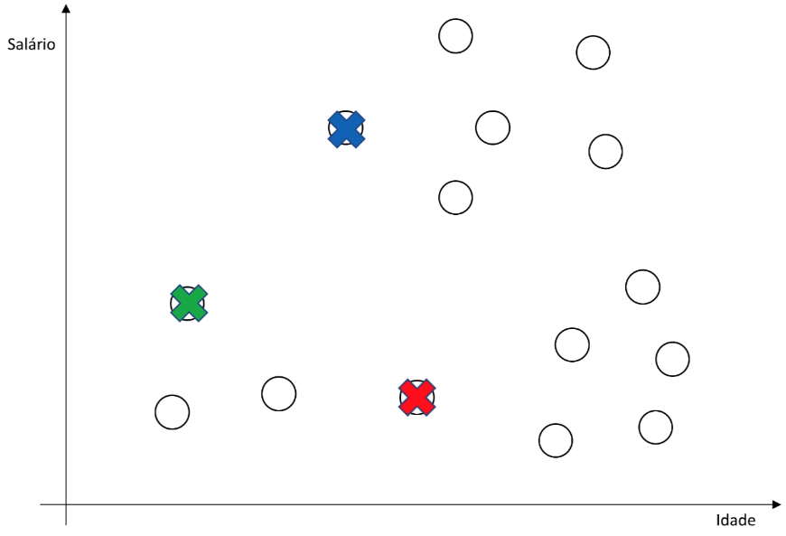
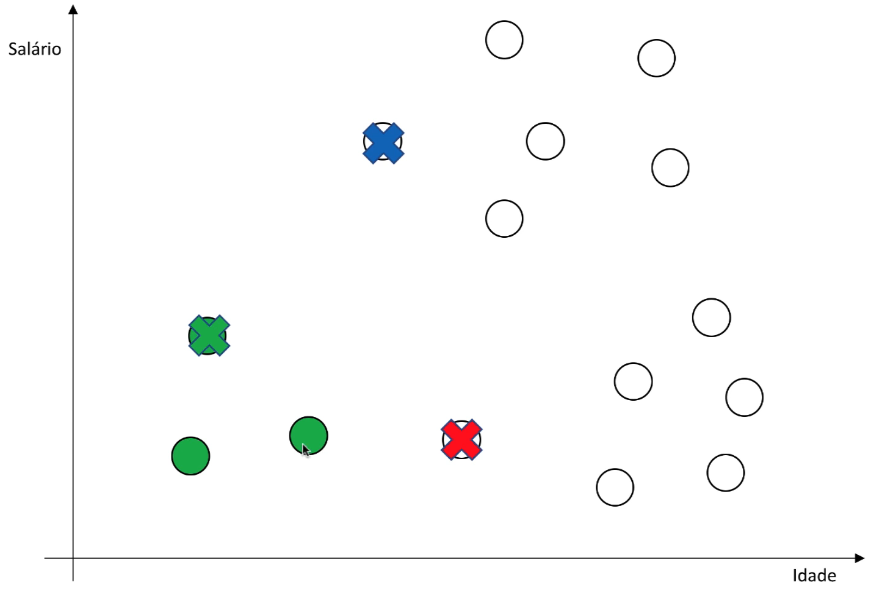
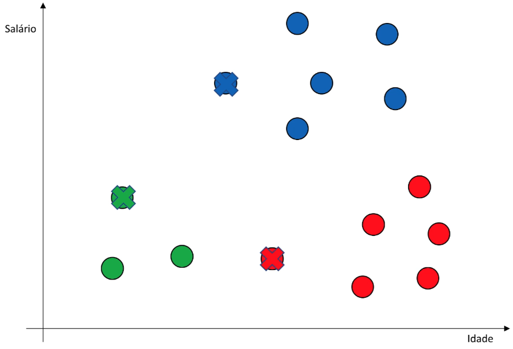
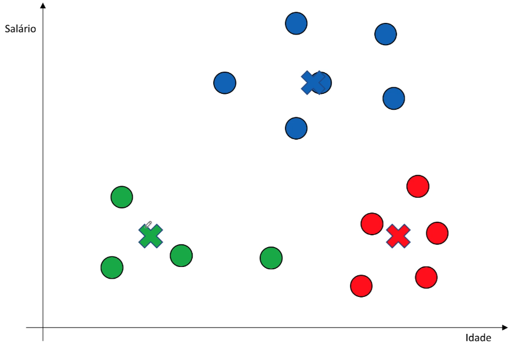

# K-means - introdução

## Agrupamento (cluster)

A análise de agrupamento, também conhecida como clustering, é uma técnica fundamental na área de mineração de dados e aprendizado de máquina não supervisionado. Ela envolve a tarefa de agrupar um conjunto de objetos ou dados em grupos ou clusters, de modo que os objetos dentro de um mesmo cluster sejam mais semelhantes entre si do que com aqueles em outros clusters. Em outras palavras, o objetivo do agrupamento é encontrar estruturas naturais ou padrões nos dados, agrupando-os com base em alguma medida de similaridade ou dissimilaridade.

O agrupamento é uma técnica amplamente utilizada em diversas áreas, incluindo:

1. **Segmentação de Mercado:** Empresas podem usar agrupamento para identificar grupos de clientes com comportamentos de compra semelhantes, permitindo a criação de estratégias de marketing direcionadas.

2. **Bioinformática:** Na genômica, o agrupamento é usado para classificar genes com base em suas expressões genéticas e ajudar a entender a função genética.

3. **Recomendação de Conteúdo:** Plataformas de streaming de música e vídeo usam agrupamento para recomendar músicas ou vídeos semelhantes com base nas preferências do usuário.

4. **Processamento de Imagens:** Em visão computacional, o agrupamento pode ser usado para segmentar uma imagem em regiões de interesse com base nas características dos pixels.

5. **Detecção de Anomalias:** O agrupamento pode ajudar a identificar dados anômalos, que não se encaixam bem em nenhum dos clusters existentes.

Existem vários algoritmos de agrupamento disponíveis, cada um com suas próprias características e aplicações. Alguns dos algoritmos mais conhecidos incluem o K-Means, o Hierarchical Clustering, o DBSCAN e o Gaussian Mixture Model (GMM).

A escolha do algoritmo de agrupamento e da medida de similaridade depende das características dos dados e dos objetivos da análise. O agrupamento é uma ferramenta poderosa para explorar estruturas em conjuntos de dados, identificar padrões ocultos e auxiliar na tomada de decisões em diversas áreas de aplicação.

## Algoritmo de Lloyd (k-means)

O algoritmo K-Means, também conhecido como o algoritmo de Lloyd, é uma das técnicas de agrupamento mais populares e amplamente utilizadas na área de mineração de dados e aprendizado de máquina. Ele é usado para agrupar dados não rotulados em clusters ou grupos com base em suas características similares.

O processo de agrupamento no algoritmo de K-Means (Lloyd) é executado nas seguintes etapas:

1. **Inicialização dos centroides**

   A primeira etapa envolve a inicialização dos centroides, que são os pontos que representam o centro de cada cluster. Inicialmente, um número fixo de $k$ centroides (geralmente definido pelo usuário) é colocado aleatoriamente no espaço de dados. Cada centroide é uma representação inicial de um grupo de pontos.

   

2. **Atribuição aos Clusters**

   Para cada ponto na base de dados, é calculada a distância entre esse ponto e todos os centroides. O ponto é então associado ao cluster representado pelo centroide mais próximo. Essa etapa é fundamental para determinar a qual grupo cada ponto pertence.

   

3. **Atualização dos Centroides**

   Após a atribuição inicial, os centroides são recalculados. Isso é feito calculando a média de todos os pontos que foram associados a cada centroide durante a etapa de atribuição. O novo centroide é então movido para a posição média desses pontos.

   

4. **Iteração**

   Os passos 2 e 3 são repetidos iterativamente até que os centroides não se movam significativamente entre as iterações ou um critério de parada predefinido seja atingido. O critério de parada pode ser baseado no número máximo de iterações, na convergência dos centroides ou em outros fatores específicos do problema.

   

O algoritmo de K-Means converge quando os centroides não se movem significativamente e, nesse ponto, os grupos finais estão formados. Os objetos pertencentes ao mesmo cluster têm características similares entre si, enquanto objetos de clusters diferentes têm características distintas.
