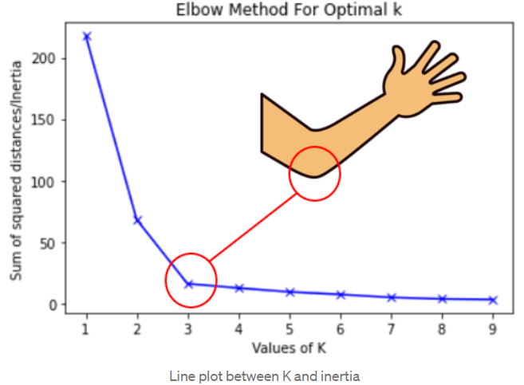

# K-means - inicialização

A inicialização no algoritmo K-Means se refere ao processo de seleção dos primeiros centroides (os centros dos agrupamentos) antes de iniciar as iterações para atribuir pontos de dados a esses clusters. Uma escolha adequada da inicialização dos centroides pode afetar significativamente o desempenho e a convergência do algoritmo K-Means.

Existem diferentes métodos de inicialização que podem ser usados, mas dois dos mais comuns são:

1. **Inicialização Aleatória**

   Nesse método, os centroides iniciais são escolhidos aleatoriamente a partir do conjunto de dados. Isso pode ser feito selecionando aleatoriamente pontos de dados existentes como os primeiros centroides. Embora seja simples de implementar, a inicialização aleatória pode levar a resultados diferentes a cada execução do algoritmo, uma vez que os centroides iniciais são selecionados aleatoriamente. Além disso, a escolha aleatória dos centroides pode levar a convergência para um ótimo local em vez de um ótimo global.

2. **Inicialização K-Means++**

   Este método foi projetado para abordar as limitações da inicialização aleatória. Ele começa selecionando um centroide aleatório do conjunto de dados como o primeiro centroide. Em seguida, os centroides subsequentes são escolhidos de forma iterativa com base em uma probabilidade ponderada, que favorece a seleção de pontos de dados mais distantes dos centroides já escolhidos. A ideia é espalhar os centroides iniciais de forma mais uniforme no espaço de dados, o que tende a levar a melhores resultados e convergência mais rápida.

A escolha da inicialização pode fazer a diferença em termos de quantas iterações o algoritmo K-Means precisa para convergir e qual é a qualidade do resultado final. A inicialização K-Means++ geralmente é preferida quando a eficiência e a qualidade são importantes, enquanto a inicialização aleatória pode ser usada para uma exploração rápida dos dados.

## Definição do número de clusters

A tarefa de determinar o número ideal de clusters em uma análise de agrupamento é crucial, pois afeta diretamente a qualidade e interpretabilidade dos resultados. Existem várias abordagens para abordar essa questão, e aqui apresentamos algumas delas:

1. **Conhecimento Prévio**
   
   Se você possui conhecimento prévio sobre o domínio do problema ou algum contexto específico, isso pode ajudar a determinar o número de clusters de forma direta. 
   
   Por exemplo, se você está segmentando clientes de uma loja de roupas e sabe que há categorias distintas, como "homens", "mulheres" e "crianças", você pode definir o número de clusters como 3 com base nesse conhecimento.

2. **Regra da Raiz Quadrada**
   
   Uma abordagem simplificada é calcular o número de clusters usando a fórmula:

   $$
   \text{clusters} = \sqrt{\frac{N}{2}}
   $$

   Onde $N$ é o número de observações ou pontos de dados em seu conjunto de dados.
   
   Essa regra fornece uma estimativa inicial do número de clusters, mas pode não ser apropriada para todos os conjuntos de dados.

3. **Método Elbow (_Elbow Method_)**
   
   O método do cotovelo é uma técnica amplamente utilizada para determinar o número ideal de clusters. Ele envolve a execução do algoritmo de agrupamento para diferentes valores de $k$, começando com $k = 1$, e calculando a métrica _Within-Cluster Sum of Squares_ (WCSS) para cada valor de $k$. O WCSS é definido como:

   $$
   \text{WCSS} = \sum_{\text{Cluster j}}{\sum_{P_i \;\text{no Cluster j}}{(\text{distance}(P_i, C_j))^2}}
   $$

   Onde:
   
   - $P_i$ são os pontos de dados em um cluster;
   - $C_j$ é o centroide do cluster $j$;
   - $\text{distance}(P_i, C_j)$ é a distância euclidiana entre o ponto de dados e o centroide.

   A ideia principal do método do cotovelo é que, à medida que o número de clusters aumenta, o valor do WCSS diminui, uma vez que os pontos são mais próximos dos centroides. No entanto, em algum ponto, adicionar mais clusters não resultará em uma redução significativa do WCSS, e isso é identificado como o "cotovelo" no gráfico. O valor de $k$ no ponto de cotovelo é frequentemente escolhido como o número ideal de clusters.

   **OBS:** A escolha da métrica WCSS é crucial e pode afetar os resultados. Configurar um valor muito alto para WCSS pode resultar em um único cluster, enquanto um valor muito baixo pode levar ao agrupamento de cada ponto de dados como um cluster separado. Portanto, é importante considerar a faixa de valores de $k$ e observar o ponto de cotovelo no gráfico.

   

É importante ressaltar que não existe uma abordagem única e definitiva para determinar o número ideal de clusters, e diferentes métodos podem fornecer resultados ligeiramente diferentes. A escolha do método depende do contexto do problema e da qualidade dos resultados obtidos em conjunto com a compreensão do domínio.