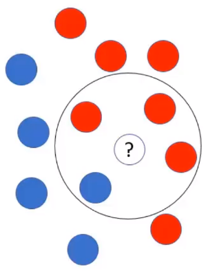

# Naïve bayes - mais conceitos

Algumas implementações do algoritmo Naïve Bayes possuem o parâmetro "radius" ou raio. Esse parâmetro indica ao algoritmo para pegar alguns pontos dentro desse raio para fazer a estimativa de probabilidade. Veja o exemplo abaixo:

Onde: 

- Bola com interrogação: novo registro a ser estimado a cor

Temos:

- $P(\text{vermelho}) = \frac{7}{12}$: probabilidade das bolas vermelhas

- $P(\text{azul}) = \frac{5}{12}$: probabilidade das bolas azuis

- $P'(\text{vermelho}) = \frac{3}{7}$: probabilidade das bolas vermelhas dentro do raio

- $P'(\text{azul}) = \frac{1}{5}$: probabilidade das bolas azuis dentro do raio

> Todas essas probabilidades são denominadas **probabilidades apriori**.

Agora, com essas estatísticas básicas calculadas, valores fazer a estimativa de cor desse novo registro com base na maior probabilidade:

- $P''(\text{vermelho}) = \frac{7}{12} \times \frac{3}{7} = \frac{21}{84} = 0.25$

- $P''(\text{azul}) = \frac{5}{12} \times \frac{1}{5} = \frac{5}{60} = 0.08$

> $P''(\text{vermelho})$ e $P''(\text{azul})$ são chamados de **probabilidades posteriori**

Portanto, o novo registro tem uma probabilidade de $0.25$ ou $76\%$ de ser vermelho.

### **Vantagens e Desvantagens do algoritmo Naive Bayes**

**Vantagens:**

- Rápido

- Simplicidade de interpretação

- Bom desempenho em análises com altas dimensões

- Boas previsões em bases pequenas (por exemplo 200 registros)

**Desvantagens:**

- Combinação de características (atributos independentes): cada par de características são independentes