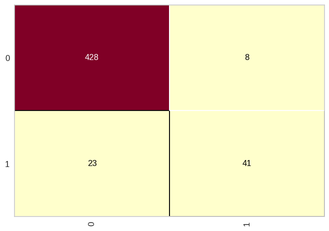

# Naïve bayes - base crédito

> ## **Biblioteca pickle**

### **Função `load`**

A função `load` da biblioteca `pickle` no Python é usada para carregar objetos serializados de um arquivo em formato binário. O módulo `pickle` permite salvar e carregar objetos Python em um formato binário que pode ser armazenado em arquivos ou transmitido através da rede.

**Sintaxe:**

```python
import pickle

with open('nome_do_arquivo.pkl', 'rb') as arquivo:
    objeto_carregado = pickle.load(arquivo)
```

**Parâmetros:**

- `'nome_do_arquivo.pkl'`: O nome do arquivo que contém o objeto serializado que você deseja carregar.

- `'rb'`: O modo de leitura de arquivo. O "r" indica que o arquivo será aberto para leitura e o "b" indica que será lido como um arquivo binário.

**Retorno:**

A função `load` carrega o objeto serializado do arquivo e o retorna como um objeto Python. O objeto retornado é uma representação exata do objeto que foi serializado e salvo anteriormente.

**Exemplo:**

```python
import pickle

# Carregando os dados de treinamento e teste do arquivo "dados.pkl"
with open("dados.pkl", "rb") as file:
    X_train_loaded, Y_train_loaded, X_test_loaded, y_test_loaded = pickle.load(file)

# Exibindo os dados carregados
print("Dados de treinamento:")
print("X_train:", X_train_loaded)
print("Y_train:", Y_train_loaded)

print("\nDados de teste:")
print("X_test:", X_test_loaded)
print("y_test:", y_test_loaded)
```

**Saída:**

```console
Dados de treinamento:
X_train: [[1, 2], [2, 3], [3, 4], [4, 5]]
Y_train: [0, 1, 0, 1]

Dados de teste:
X_test: [[1.5, 3.5], [3.5, 6.0]]
y_test: [0, 1]
```

Neste exemplo, carregamos os dados do arquivo `dados.pkl` usando `pickle.load()` e exibimos os dados carregados na saída. Os dados carregados são idênticos aos dados originais que foram salvos, demonstrando que o processo de salvamento e carregamento usando pickle foi bem-sucedido.

**Conclusão:**

A função `load` do módulo `pickle` é uma maneira conveniente de carregar objetos Python serializados de arquivos binários, tornando mais fácil salvar e recuperar dados complexos ou modelos treinados em suas aplicações.

> ## **Biblioteca Sklearn**

### **Função `accuracy_score`**

A função `accuracy_score` faz parte do módulo `sklearn.metrics` da biblioteca Scikit-learn. Essa função é usada para calcular a acurácia, ou seja, a quantidade de previsões corretas, de um modelo de classificação, que é uma métrica comum para avaliar o desempenho de algoritmos de aprendizado de máquina em problemas de classificação.

**Sintaxe:**

```python
from sklearn.metrics import accuracy_score

accuracy = accuracy_score(y_true, y_pred)
```

**Parâmetros:**

- `y_true`: Array de formato (n_samples,) ou lista que contém as verdadeiras classes alvo (dados para teste) das amostras.

- `y_pred`: Array de formato (n_samples,) ou lista que contém as previsões de classe feitas pelo modelo para as amostras.

**Retorno:**

- `accuracy`: Um número entre 0 e 1, representando a acurácia do modelo. Quanto maior o valor, melhor o desempenho do modelo em fazer previsões corretas.

**Exemplo:**

```python
from sklearn.metrics import accuracy_score

# Dados verdadeiros (ground truth)
y_true = [0, 1, 0, 1, 0, 1]

# Previsões do modelo
y_pred = [0, 1, 0, 1, 1, 1]

# Calculando a acurácia do modelo
accuracy = accuracy_score(y_true, y_pred)

print("Acurácia:", accuracy)
```

Saída:

```
Acurácia: 0.8333333333333334
```

Neste exemplo, temos um conjunto de dados de verdadeiras classes alvo `y_true` e as previsões do modelo `y_pred`. Usando a função `accuracy_score`, calculamos a acurácia do modelo, que nos diz que o modelo acertou corretamente cerca de 83,33% das previsões feitas.

**Conclusão**

A função `accuracy_score` é uma ferramenta útil para avaliar o desempenho de modelos de classificação. Ela fornece uma medida simples e intuitiva da precisão das previsões, o que ajuda a determinar quão bem o modelo está se saindo em relação aos dados verdadeiros. No entanto, é importante considerar outras métricas, especialmente quando há classes desbalanceadas ou quando erros de diferentes tipos têm custos diferentes.

### **Função `confusion_matrix`**

A função `confusion_matrix` faz parte do módulo `sklearn.metrics` da biblioteca Scikit-learn. Essa função é usada para calcular a matriz de confusão de um modelo de classificação, que é uma tabela que mostra a contagem de verdadeiros positivos (TP), falsos positivos (FP), verdadeiros negativos (TN) e falsos negativos (FN) em um problema de classificação.

**Sintaxe:**

```python
from sklearn.metrics import confusion_matrix

conf_matrix = confusion_matrix(y_true, y_pred)
```

**Parâmetros:**

- `y_true`: Array de formato (n_samples,) ou lista que contém as verdadeiras classes alvo (dados de teste) das amostras.

- `y_pred`: Array de formato (n_samples,) ou lista que contém as previsões de classe feitas pelo modelo para as amostras.

**Retorno:**

- `conf_matrix`: Matriz de formato (n_classes, n_classes) que representa a matriz de confusão do modelo. A matriz é organizada da seguinte forma:

  |                      | Classe Prevista Negativa | Classe Prevista Positiva |
  | -------------------- | ------------------------ | ------------------------ |
  | Classe Real Negativa | Verdadeiro Negativo (TN) | Falso Positivo (FP)      |
  | Classe Real Positiva | Falso Negativo (FN)      | Verdadeiro Positivo (TP) |

**Exemplo:**

```python
from sklearn.metrics import confusion_matrix

# Dados verdadeiros (ground truth)
y_true = [1, 0, 1, 0, 1, 1, 0, 1]

# Previsões do modelo
y_pred = [1, 0, 1, 1, 0, 1, 0, 0]

# Calculando a matriz de confusão do modelo
conf_matrix = confusion_matrix(y_true, y_pred)

print("Matriz de Confusão:")
print(conf_matrix)
```

Saída:

```
Matriz de Confusão:
[[2 2]
 [1 3]]
```

Neste exemplo, temos um conjunto de dados de verdadeiras classes alvo `y_true` e as previsões do modelo `y_pred`. Usando a função `confusion_matrix`, calculamos a matriz de confusão do modelo, que nos mostra que:

- Há 2 verdadeiros positivos (TP), ou seja, o modelo acertou 2 amostras da classe positiva.

- Há 3 verdadeiros negativos (TN), ou seja, o modelo acertou 3 amostras da classe negativa.

- Há 2 falsos positivos (FP), ou seja, o modelo errou 2 amostras prevendo a classe positiva incorretamente.

- Há 1 falso negativo (FN), ou seja, o modelo errou 1 amostra prevendo a classe negativa incorretamente.

**Conclusão**

A matriz de confusão é uma ferramenta importante para avaliar o desempenho de um modelo de classificação, pois fornece uma visão detalhada das previsões corretas e incorretas feitas pelo modelo para cada classe. Essa informação é útil para calcular várias métricas de avaliação, como precisão, recall, F1-score, entre outras, que ajudam a entender melhor o desempenho do modelo em diferentes cenários de classificação.

### **Função `classification_report`**

A função `classification_report` do módulo `sklearn.metrics` do scikit-learn é uma ferramenta útil para avaliar o desempenho de um modelo de classificação. Ela fornece um relatório detalhado contendo várias métricas de avaliação para cada classe presente no conjunto de dados.

**Sintaxe:**

```python
from sklearn.metrics import classification_report

report = classification_report(y_true, y_pred)
```

**Parâmetros:**

- `y_true`: Array-like ou lista contendo as classes verdadeiras (dados de teste) das amostras de teste.

- `y_pred`: Array-like ou lista contendo as classes previstas pelo modelo para as amostras de teste.

**Retorno:**

A função retorna uma string contendo o relatório de avaliação com as seguintes métricas para cada classe:

- Precision (Precisão): A proporção de verdadeiros positivos em relação a todos os positivos previstos. Representa a precisão do modelo em identificar corretamente os verdadeiros positivos.

- Recall (Sensibilidade ou Revocação): A proporção de verdadeiros positivos em relação a todos os verdadeiros positivos reais. Representa a capacidade do modelo de encontrar corretamente os verdadeiros positivos.

- F1-score: A média harmônica entre a precisão e o recall. É uma medida balanceada que leva em consideração tanto a precisão quanto o recall.

- Support (Suporte): O número de ocorrências de cada classe no conjunto de teste.

- Accuracy (Acurácia): A proporção de previsões corretas em relação a todas as previsões. Representa a taxa geral de acerto do modelo.

**Exemplo:**

```python
from sklearn.metrics import classification_report
from sklearn.datasets import load_iris
from sklearn.model_selection import train_test_split
from sklearn.naive_bayes import GaussianNB

# Carregar o conjunto de dados
with open("credit.pkl", "rb") as file:
    X_credit_train, y_credit_train, X_credit_test, y_credit_test = pickle.load(file)

# Criar o modelo Naive Bayes Gaussiano
naive_credit_data = GaussianNB()
naive_credit_data.fit(X_credit_train, y_credit_train)

# Fazer previsões no conjunto de teste
predict = naive_credit_data.predict(X_credit_test)

# Gerar o relatório de avaliação
report = classification_report(y_credit_test, predict)
print(report)
```

**Saída:**

|              | precision   | recall   | f1-score   | support   |
| ------------ | ----------- | -------- | ---------- | --------- |
| 0            | 0.95        | 0.98     | 0.97       | 436       |
| 1            | 0.84        | 0.64     | 0.73       | 64        |
| -----------  | ----------- | -------- | ---------- | --------- |
| accuracy     |             |          | 0.94       | 500       |
| macro avg    | 0.89        | 0.81     | 0.85       | 500       |
| weighted avg | 0.93        | 0.94     | 0.93       | 500       |

Neste exemplo, estamos usando o conjunto de dados de risco de crédito e um modelo de Naive Bayes Gaussiano para classificação. Após ajustar o modelo e fazer previsões no conjunto de teste, geramos o relatório de avaliação usando a função `classification_report` para analisar o desempenho do modelo em cada classe. 

Um ponto de atenção em relação aos informações presentes no relatório é os valores relativamente baixos de precisão e sensibilidade para a previsão de classificação como "não pagadores" (1), que no cenário da utilização desse algoritmo por um banco não serio o ideal, uma vez que há grande chances da instituição perder dinheiro com calote.

**Conclusão:**

A função `classification_report` é uma ferramenta útil para avaliar o desempenho de um modelo de classificação, fornecendo informações detalhadas sobre as métricas de avaliação para cada classe presente nos dados de teste. Ela ajuda a compreender a qualidade das previsões e a identificar áreas de melhoria para o modelo.

> ## **Biblioteca yellowbrick**

### **Classe `ConfusionMatrix`**

A `ConfusionMatrix` é uma visualização do Yellowbrick, uma biblioteca para visualização de análises de aprendizado de máquina em Python. A classe `ConfusionMatrix` permite criar e visualizar a matriz de confusão para avaliar o desempenho de modelos de classificação.

**Funcionalidade:**

A matriz de confusão é uma tabela que mostra as previsões feitas por um modelo de classificação em relação às classes reais das amostras de teste. Ela é usada para avaliar o desempenho do modelo e entender melhor os erros e acertos em cada classe.

**Sintaxe:**

```python
from yellowbrick.classifier import ConfusionMatrix

# Criar a visualização
cm = ConfusionMatrix(model)

# Ajustar o modelo e criar a matriz de confusão
cm.fit(X_train, y_train)

# Visualizar a matriz de confusão
cm.score()
```

**Parâmetros:**

- `model`: O estimador (modelo) do Scikit-learn que implementa o algoritmo de classificação. Por exemplo, pode ser um objeto de uma das classes como `GaussianNB`, `LogisticRegression`, `RandomForestClassifier`, entre outros.

- `X_train`: Array-like ou matriz esparsa de formato (n_samples, n_features) que representa os dados de treinamento.

- `y_train`: Array-like ou lista que contém as classes alvo (rótulos) das amostras de treinamento.

**Visualização:**

A matriz de confusão é visualizada através de uma tabela colorida que mostra os valores verdadeiros e previstos para cada classe. As células na diagonal representam as previsões corretas, enquanto as células fora da diagonal representam os erros de classificação.

- Verdadeiro Positivo (TP): Os casos em que o modelo previu corretamente a classe positiva.

- Verdadeiro Negativo (TN): Os casos em que o modelo previu corretamente a classe negativa.

- Falso Positivo (FP): Os casos em que o modelo previu incorretamente a classe positiva.

- Falso Negativo (FN): Os casos em que o modelo previu incorretamente a classe negativa.

A matriz de confusão é uma ferramenta visual poderosa para avaliar a precisão, recall, F1-score e outras métricas de desempenho de um modelo de classificação.

**Exemplo:**

```python
from yellowbrick.classifier import ConfusionMatrix
from sklearn.naive_bayes import GaussianNB

# Carregar o conjunto de dados
with open("credit.pkl", "rb") as file:
    X_credit_train, y_credit_train, X_credit_test, y_credit_test = pickle.load(file)

# Criar o modelo Naive Bayes Gaussiano
naive_credit_data = GaussianNB()
naive_credit_data.fit(X_credit_train, y_credit_train)

# Criar a visualização da matriz de confusão
cm = ConfusionMatrix(naive_credit_data)

# Ajustar o modelo e criar a matriz de confusão
cm.fit(X_credit_train, y_credit_train)

# Visualizar a matriz de confusão
cm.score(X_credit_test, y_credit_test)
```

**Saída:**



Neste exemplo, estamos usando o conjunto de dados de risco de crédito, onde estamos treinando um modelo de Naive Bayes Gaussiano e visualizando a matriz de confusão para avaliar o desempenho do modelo em um conjunto de teste.

**Conclusão:**

A visualização da matriz de confusão é uma ferramenta importante para avaliar o desempenho de modelos de classificação e entender os erros e acertos em cada classe. O Yellowbrick facilita a criação e visualização da matriz de confusão, permitindo uma análise mais detalhada do desempenho do modelo de classificação.
