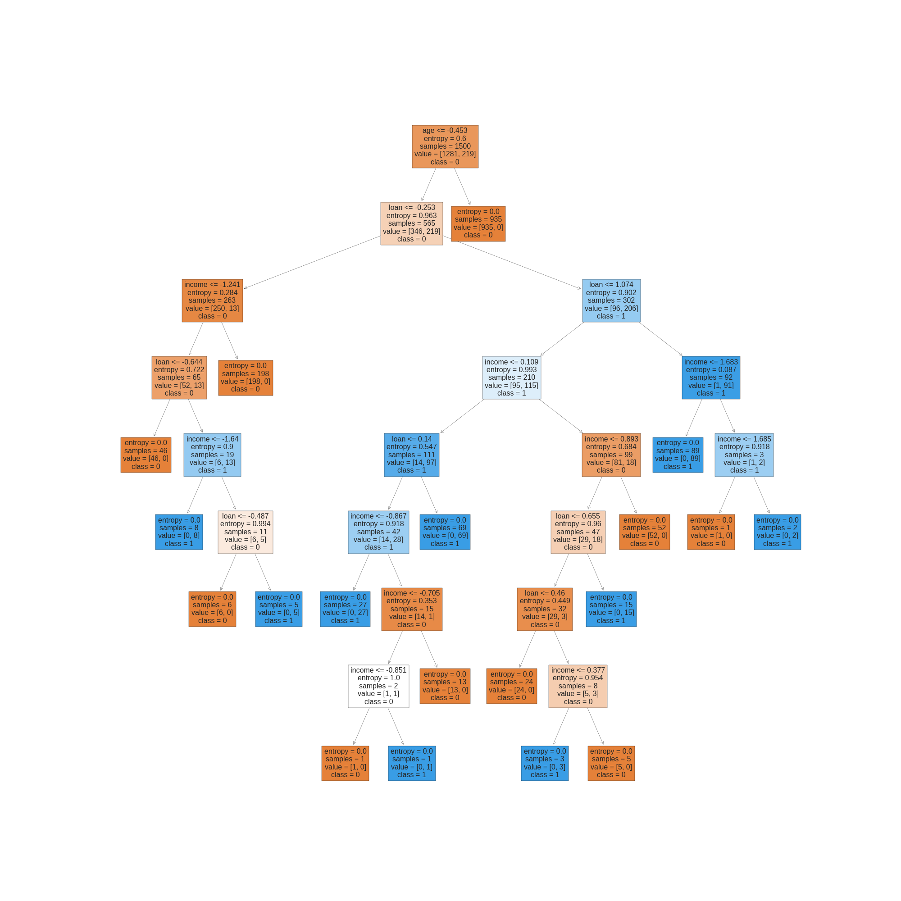

# Árvores de decisão - base crédito

> ## **Biblioteca matplotlib**

### **Função `subplots`**

A função `subplots()` é uma função do módulo `matplotlib.pyplot` da biblioteca Matplotlib em Python, que é utilizada para criar uma figura e um conjunto de eixos (subplots) em uma única chamada. Os subplots são usados para organizar várias visualizações em uma única figura.

**Sintaxe:**

```python
fig, ax = plt.subplots(nrows, ncols, ...)
```

**Parâmetros:**

- `nrows`: O número de linhas de subplots que serão criados na figura. Este parâmetro define quantos subplots serão empilhados verticalmente na figura.

- `ncols`: O número de colunas de subplots que serão criados na figura. Este parâmetro define quantos subplots serão dispostos horizontalmente na figura.

- `figsize`: É uma tupla `(largura, altura)` que define o tamanho da figura em polegadas. Por exemplo, `figsize=(8, 6)` criará uma figura com 8 polegadas de largura e 6 polegadas de altura. Esse parâmetro é opcional, e se não for especificado, o tamanho padrão da figura será usado.

**Retorno:**

- `fig`: A figura criada.

- `ax`: Um array de objetos de eixos (subplots) criados.

**Exemplo de Uso:**

```python
import matplotlib.pyplot as plt

# Criando uma figura com 2 linhas e 2 colunas de subplots
fig, ax = plt.subplots(nrows=2, ncols=2)

# Plotando dados em cada subplot
ax[0, 0].plot([1, 2, 3, 4], [1, 4, 2, 3])
ax[0, 0].set_title('Subplot 1')

ax[0, 1].scatter([1, 2, 3, 4], [1, 4, 2, 3])
ax[0, 1].set_title('Subplot 2')

ax[1, 0].bar([1, 2, 3, 4], [1, 4, 2, 3])
ax[1, 0].set_title('Subplot 3')

ax[1, 1].plot([1, 2, 3, 4], [1, 4, 2, 3], 'o-')
ax[1, 1].set_title('Subplot 4')

# Exibindo a figura com os subplots
plt.tight_layout()
plt.show()
```

Neste exemplo, criamos uma figura com 2 linhas e 2 colunas de subplots usando a função `subplots()`. Em seguida, plotamos dados em cada subplot usando os objetos de eixos `ax`. O resultado é uma única figura contendo 4 subplots organizados em uma matriz 2x2.

### **Função `tight_layout`**

A função `tight_layout()` do módulo `matplotlib.pyplot` é utilizada para ajustar automaticamente os espaçamentos entre os elementos de um gráfico, de modo a evitar sobreposições e melhorar a aparência geral da figura.

Quando múltiplos subplots são criados em uma figura usando o método `subplots()` ou outras funções de criação de subplots, pode haver sobreposição de rótulos, eixos, títulos ou outros elementos gráficos. A chamada a `tight_layout()` resolve esse problema, garantindo que todos os elementos sejam posicionados de forma adequada dentro da figura, sem sobreposições.

Essa função é especialmente útil quando se trabalha com várias visualizações em uma mesma figura, como subplots, e é uma forma simples de melhorar a legibilidade e estética dos gráficos.

> ## **Biblioteca Sklearn**

### **Função `plot_tree`**

A função `plot_tree` do módulo `sklearn.tree` é utilizada para visualizar a estrutura de uma árvore de decisão criada com o algoritmo DecisionTreeClassifier ou DecisionTreeRegressor do scikit-learn. Essa função permite que os usuários observem graficamente como a árvore foi construída e como os dados são divididos em cada nó da árvore.

**Sintaxe:**

```python
from sklearn.tree import plot_tree

plot_tree(decision_tree, feature_names=None, class_names=None, filled=True, rounded=True, impurity=True)
```

**Parâmetros:**

- `decision_tree`: O modelo de árvore de decisão criado pelo DecisionTreeClassifier ou DecisionTreeRegressor que se deseja visualizar.

- `feature_names` (opcional): Uma lista contendo os nomes das características (atributos) usados na árvore. Se não for fornecido, serão usados nomes genéricos como "feature_0", "feature_1", etc.

- `class_names` (opcional): Uma lista contendo os nomes das classes de saída do modelo, usadas em problemas de classificação. Se não for fornecido, serão usados valores numéricos para representar as classes.

- `filled` (opcional): Um valor booleano que indica se os nós da árvore serão coloridos para mostrar a classe de destino mais frequente para problemas de classificação ou a média dos valores de destino para problemas de regressão.

- `rounded` (opcional): Um valor booleano que indica se os nós da árvore terão bordas arredondadas.

- `impurity` (opcional): Um valor booleano que indica se a impureza dos nós será mostrada. A impureza é uma medida de quão misturados estão os dados em cada nó da árvore.

**Exemplo:**

```python
from sklearn.tree import DecisionTreeClassifier
from sklearn.tree import plot_tree
import matplotlib.pyplot as plt

# Carregar o conjunto de dados de crédito
with open("credit.pkl", "rb") as file:
    X_credit_train, y_credit_train, X_credit_test, y_credit_test = pickle.load(file)

# Criar o modelo de árvore de decisão
credit_tree = DecisionTreeClassifier(criterion="entropy", random_state=0)
credit_tree.fit(X_credit_train, y_credit_train)

# Visualizar a árvore de decisão
forecasters = ["income", "age", "loan"]

fig, axis = plt.subplots(nrows=1, ncols=1, figsize=(20, 20))

credit_class_names = [str(i) for i in credit_tree.classes_]
tree.plot_tree(credit_tree, feature_names=forecasters, class_names=credit_class_names, filled=True)
```

**Saída:**



No exemplo acima, carregamos o conjunto de dados de crédito, criamos um modelo de árvore de decisão e o ajustamos aos dados. Em seguida, utilizamos a função `plot_tree` para visualizar a árvore criada. O parâmetro `feature_names` é usado para fornecer os nomes das características do conjunto de dados, o parâmetro `class_names` é usado para fornecer os nomes das classes de saída e os parâmetros `filled`, `rounded` e `impurity` são usados para estilizar a visualização da árvore.

**Conclusão:**

A visualização da árvore de decisão mostra como os dados são divididos em cada nó, quais as características são usadas para fazer as divisões e a classe de destino associada a cada nó terminal. Essa visualização é uma ferramenta útil para entender como a árvore toma decisões com base nos dados de entrada.
