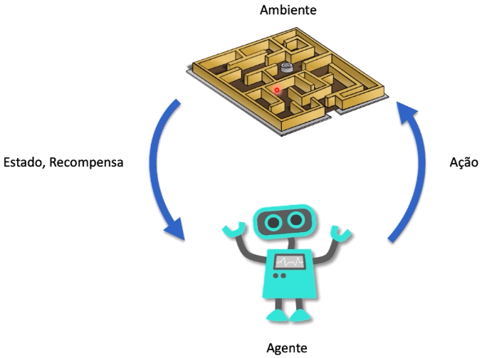
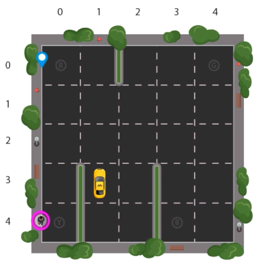
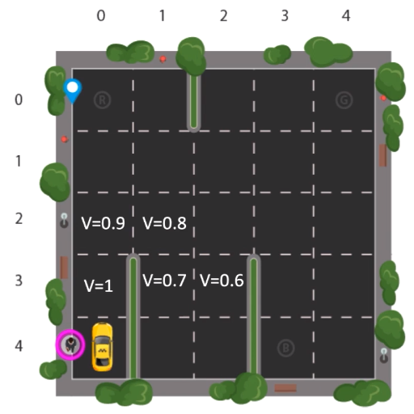

# Teoria

A aprendizagem por reforço é um paradigma de aprendizado de máquina que se baseia na interação de um agente com um ambiente para que o agente aprenda a tomar ações que maximizem uma recompensa cumulativa ao longo do tempo. Essa abordagem é frequentemente aplicada a problemas em que um agente deve tomar sequências de decisões para atingir um objetivo específico. Aqui estão os principais elementos que compõem a aprendizagem por reforço:

**1. Ambiente:**
O ambiente é o espaço no qual o agente opera e interage. Ele é definido por um conjunto de estados possíveis e as transições entre esses estados, geralmente representadas por meio de um modelo de probabilidade. Cada estado do ambiente representa uma configuração específica em um ponto no tempo. O ambiente também fornece recompensas ao agente como feedback sobre suas ações.

**2. Agente:**
O agente é a entidade de tomada de decisões que interage com o ambiente. O agente toma decisões com base em seu conhecimento e nas informações que recebe do ambiente. O objetivo do agente é aprender a política de ação ideal, ou seja, a estratégia que determina qual ação tomar em cada estado para maximizar a recompensa cumulativa.

**3. Ação:**
As ações representam as escolhas disponíveis para o agente em um determinado estado. O agente seleciona ação(s) com base em sua estratégia de política. A sequência de ações tomadas pelo agente ao longo do tempo forma sua política de ação, que é o cerne do aprendizado por reforço.

**4. Estado:**
O estado é uma representação do ambiente em um determinado momento. Ele captura todas as informações relevantes que o agente precisa para tomar decisões. O estado pode ser observável (totalmente conhecido pelo agente) ou parcialmente observável (algumas informações são ocultas).

**5. Recompensa:**
A recompensa é um valor numérico que o ambiente fornece ao agente após cada ação. A recompensa é usada pelo agente para avaliar o quão boa ou ruim foi sua ação. O objetivo do agente é maximizar a recompensa cumulativa ao longo do tempo.

A equação de Bellman é uma ferramenta-chave na aprendizagem por reforço e fornece uma maneira de calcular o valor esperado de um estado ou estado-ação. Ela é expressa em duas formas: a equação de Bellman para o valor de estado (V) e a equação de Bellman para o valor de ação (Q).

**Equação de Bellman para o Valor de Estado (V):**

A equação de Bellman para V é uma expressão que descreve o valor esperado de um estado em relação ao valor esperado do próximo estado e à recompensa imediata. É definida da seguinte forma:

$$
V(s) = \sum_{a} \pi(a|s) \sum_{s', r} p(s', r|s, a) [r + \gamma V(s')]
$$

- $V(s)$: O valor esperado do estado $s$.
- $\pi(a|s)$: A política que determina a probabilidade de tomar ação $a$ no estado $s$.
- $p(s', r|s, a)$: A probabilidade de transição para o próximo estado $s'$ e receber a recompensa $r$ ao tomar a ação $a$ no estado $s$.
- $\gamma$: O fator de desconto que controla o peso dado a recompensas futuras.

**Equação de Bellman para o Valor de Ação (Q):**

A equação de Bellman para Q é semelhante, mas se aplica diretamente às ações:

$$
Q(s, a) = \sum_{s', r} p(s', r|s, a) [r + \gamma \max_{a'} Q(s', a')]
$$

- $Q(s, a)$: O valor esperado do estado-ação $(s, a)$.
- $p(s', r|s, a)$: A probabilidade de transição para o próximo estado $s'$ e receber a recompensa $r$ ao tomar a ação $a$ no estado $s$.
- $\gamma$: O fator de desconto que controla o peso dado a recompensas futuras.
- $\max_{a'} Q(s', a')$: O valor esperado máximo do próximo estado $s'$, considerando todas as possíveis ações $a'$.

Essas equações de Bellman são fundamentais para a modelagem e solução de problemas de aprendizado por reforço, permitindo que os agentes avaliem e atualizem suas políticas para maximizar a recompensa cumulativa ao longo do tempo. Elas formam a base de muitos algoritmos de aprendizado por reforço, incluindo o Q-Learning e a Iteração de Valor.

**Markov Decision Process (MDP)** 

é um modelo matemático usado na aprendizagem por reforço para representar sistemas de tomada de decisão sequencial. Consiste em um conjunto de estados possíveis, um conjunto de ações disponíveis, uma função de transição de estado e uma função de recompensa. A característica fundamental de um MDP é a propriedade de Markov, que significa que a transição de estado depende apenas do estado atual e da ação tomada, independentemente de como o sistema chegou a esse estado.

- **Ambientes Determinísticos:** Em um ambiente determinístico, as ações do agente sempre levam a resultados previsíveis. Isso significa que, dadas as mesmas condições iniciais e ações, o agente sempre alcançará o mesmo estado subsequente. Não há incerteza nas transições de estado.

- **Ambientes Não Determinísticos:** Em ambientes não determinísticos, as ações do agente podem levar a resultados diferentes, mesmo se as condições iniciais e as ações forem idênticas. Isso introduz incerteza nas transições de estado, tornando a tarefa de aprendizado mais desafiadora, pois o agente deve lidar com a aleatoriedade.

**Conceito de Exploration e Exploitation:**

O dilema da exploração e exploração é central na aprendizagem por reforço. Envolve a decisão de quando um agente deve explorar novas ações ou explorar ações conhecidas que parecem ser as melhores. Essa decisão é crítica para o aprendizado eficaz.

- **Exploração:** Refere-se à escolha de ações que o agente ainda não experimentou ou que têm resultados desconhecidos. A exploração é necessária para descobrir informações sobre o ambiente e encontrar ações que possam levar a recompensas mais altas no futuro. No entanto, a exploração envolve riscos, pois as ações desconhecidas podem levar a recompensas baixas.

- **Exploitação:** Refere-se à escolha de ações que o agente acredita serem as melhores com base no conhecimento atual. A exploração é preferida quando o agente deseja maximizar as recompensas imediatas, pois escolher ações conhecidas pode ser menos arriscado.

O desafio é encontrar um equilíbrio entre a exploração e a exploração. Se o agente explorar demais, pode não aproveitar ações conhecidas que levam a recompensas altas. Se o agente explorar muito pouco, pode não descobrir ações melhores e ficar preso em políticas subótimas.

**Q-Learning:**

**Q-learning** é um dos algoritmos mais populares na aprendizagem por reforço para resolver tarefas de aprendizado por reforço baseadas em MDPs. O objetivo do Q-learning é aprender uma função chamada Q-função, que atribui um valor a cada par estado-ação. O valor Q indica a recompensa esperada de executar uma ação em um estado e, em seguida, seguir uma política específica.

O Q-learning é uma técnica de aprendizado off-policy, o que significa que ele aprende uma política de ação ótima, mesmo que as ações tenham sido tomadas seguindo uma política diferente (geralmente uma política de exploração). Ele usa a Equação de Bellman para atualizar iterativamente os valores Q com base nas recompensas reais observadas. À medida que o agente interage com o ambiente, ele ajusta suas estimativas de valor Q e, eventualmente, converge para a política ótima.

O Q-learning é usado em muitas aplicações, como jogos, robótica e automação industrial, onde um agente deve aprender a tomar decisões sequenciais para maximizar as recompensas ao longo do tempo. É uma ferramenta poderosa para resolver problemas de aprendizado por reforço baseados em MDPs.

**Exemplo:**

A seguir um exemplo para ilustrar o processo de aprendizagem:

Considere um problema no qual o taxi precisa pegar o passageiro em Y e deixá-lo nos destinos R, B e G. Para isso, é necessário seguir algumas regras.

Os movimentos (ações) permitidos são:

- Cima
- Baixo
- Esquerda
- Direita
- Pegar o passageiro
- Deixar o passageiro
  
As recompensas são:

- -10: buscar o passageiro no lugar errado
- -10: deixar o passageiro no lugar errado
- -1: andar no ambiente (_living penalty_)
- 20: buscar e deixar o passageiro no local correto

A partir do conhecimento dos critérios de aprendizagem, as imagens a seguir mostram o passo a passo de execução do algoritmo.

> Lembrando que o algoritmo percorre sempre o caminho com o menor valor para $V$ que é obtido por $\gamma \cdot V_{anterior}$

É importante notar que a aprendizagem por reforço é frequentemente usada em cenários onde não há supervisão explícita, ou seja, o agente não recebe informações sobre quais ações são corretas ou erradas, mas deve descobrir a melhor estratégia através de tentativa e erro. Essa abordagem é poderosa e pode ser aplicada a uma ampla gama de problemas de aprendizado de máquina, incluindo jogos, robótica, automação e muito mais.
