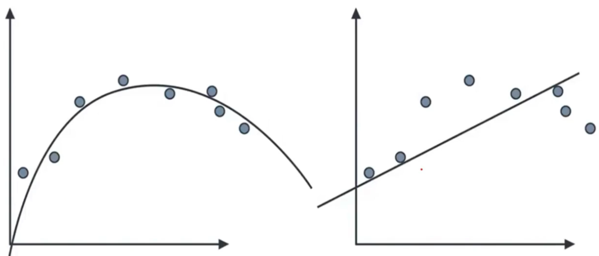
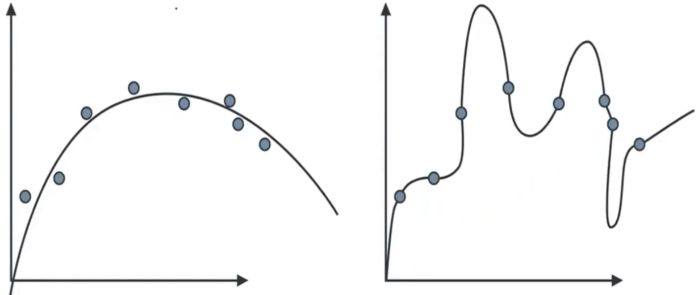

# Overfitting e underfitting

Underfitting e overfitting são dois problemas comuns em aprendizado de máquina e representam situações em que um modelo não generaliza bem para novos dados.

**Underfitting:**

> O gráfico a esquerda representa o modelo ideal, já a direita mostra o problema de _underfitting_.

- _Underfitting_ ocorre quando um modelo é muito simples para capturar as nuances nos dados.
- O modelo não consegue se ajustar aos padrões nos dados de treinamento e, como resultado, tem um desempenho ruim tanto nos dados de treinamento quanto nos dados de teste.
- Geralmente, ocorre quando o modelo é muito simples, possui poucos parâmetros ou não é treinado por tempo suficiente.
- Pode ser identificado quando o modelo possui um erro alto nos dados de treinamento e teste.

**Overfitting:**

> O gráfico a esquerda representa o modelo ideal, já a direita mostra o problema de _overfitting_.

- _Overfitting_ ocorre quando um modelo é muito complexo e se ajusta excessivamente aos dados de treinamento.
- O modelo captura o ruído nos dados de treinamento, em vez dos padrões gerais, levando a um desempenho excelente nos dados de treinamento, mas um mau desempenho nos dados de teste.
- Geralmente, ocorre quando o modelo tem muitos parâmetros ou é treinado por muitas iterações.
- Pode ser identificado quando o modelo tem um erro muito baixo nos dados de treinamento, mas um erro alto nos dados de teste.

**Como lidar:**

- Para underfitting, é necessário aumentar a complexidade do modelo, adicionar mais atributos relevantes ou treinar por mais tempo.
- Para overfitting, é necessário simplificar o modelo, reduzindo o número de parâmetros, aplicando regularização ou aumentando o tamanho do conjunto de treinamento.
- A validação cruzada e o monitoramento do desempenho em conjuntos de treinamento e teste podem ajudar a identificar e mitigar esses problemas.
