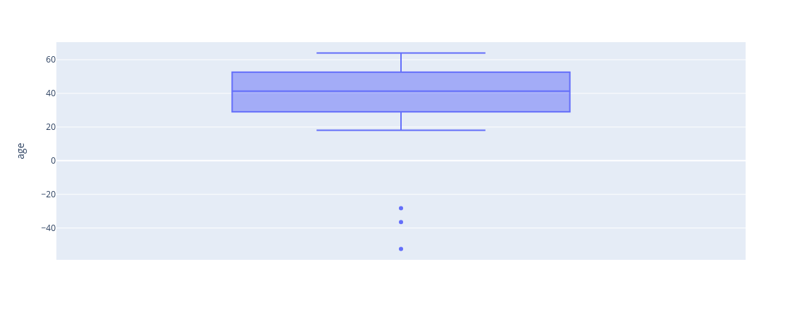

# Detecção de outliers com boxplot

O boxplot, também conhecido como gráfico de caixa, é uma ferramenta poderosa para visualizar a distribuição de um conjunto de dados e identificar a presença de outliers. Ele fornece uma representação gráfica dos principais pontos estatísticos de um conjunto de dados e é especialmente útil para comparar várias distribuições lado a lado.

**Construção de um boxplot:**

Para criar um boxplot, siga estas etapas:

1. **Ordenar os dados:** Primeiro, ordene os dados em ordem crescente.

2. **Calcular os Quartis:** Em seguida, calcule três quartis:

   - Primeiro Quartil (Q1): O valor que divide os 25% mais baixos dos dados.
   - Segundo Quartil (Q2): O valor que divide os 50% do meio dos dados; é igual à mediana.
   - Terceiro Quartil (Q3): O valor que divide os 25% mais altos dos dados.

3. **Calcular os Limites dos Bigodes (Whiskers):** Os bigodes são as linhas que se estendem a partir do retângulo central do boxplot. Eles são calculados da seguinte forma:

   - Limite Inferior do Bigode: Q1 - 1,5 \* (Q3 - Q1)
   - Limite Superior do Bigode: Q3 + 1,5 \* (Q3 - Q1)

4. **Identificar Outliers:** Os outliers são pontos que estão fora dos limites dos bigodes. Em outras palavras, qualquer ponto abaixo do limite inferior do bigode ou acima do limite superior do bigode é considerado um outlier.

**Interpretação de um boxplot:**

- O retângulo central representa o intervalo interquartil (IQR), que contém a maioria dos dados (50%).
- A linha dentro do retângulo representa a mediana (Q2), que divide o conjunto de dados ao meio.
- Os bigodes se estendem a partir do retângulo para fora até os valores mínimos e máximos dentro dos limites aceitáveis (1,5 vezes o IQR).
- Outliers são pontos individuais que estão além dos limites dos bigodes.

**Identificação de outliers com um boxplot:**

- **Outliers Inferiores:** Qualquer ponto que esteja abaixo do limite inferior do bigode é um outlier inferior. Esses valores são considerados excepcionalmente baixos em relação à maioria dos dados.

- **Outliers Superiores:** Qualquer ponto que esteja acima do limite superior do bigode é um outlier superior. Esses valores são considerados excepcionalmente altos em relação à maioria dos dados.

- **Outliers Extremos:** Além dos outliers inferiores e superiores, os pontos que estão muito longe dos bigodes, geralmente a mais de 3 vezes o IQR, são considerados outliers extremos.

A principal vantagem do boxplot é que ele fornece uma representação visual clara da distribuição dos dados e torna os outliers facilmente identificáveis. Isso ajuda os analistas de dados a entender a natureza dos dados e a decidir como lidar com os outliers, seja removendo-os, investigando-os ou aplicando técnicas de tratamento específicas. Além disso, o boxplot é útil para comparar várias distribuições de dados e identificar discrepâncias entre elas.
