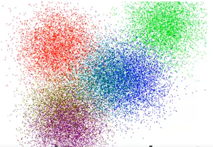
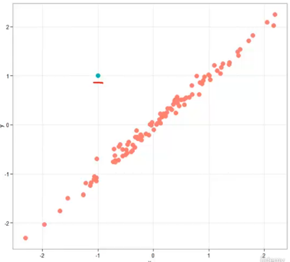
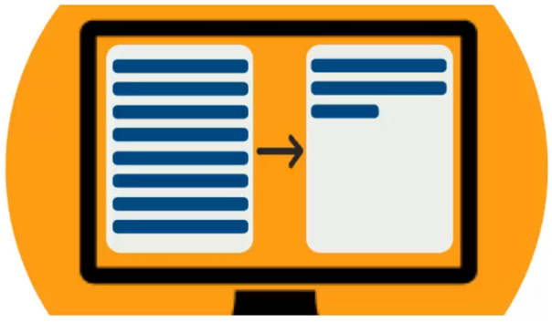

# Métodos descritivos

Métodos descritivos são técnicas utilizadas na ciência de dados e análise de dados para resumir, explorar e descrever as características e padrões presentes nos conjuntos de dados. Esses métodos não têm o objetivo de fazer previsões, mas sim de fornecer insights e informações valiosas para entender melhor os dados.

### **Associação**

O método de associação busca identificar relações e conexões frequentes entre itens em conjuntos de transações ou eventos.

Essa técnica pode ser utilizado nos seguintes cenários:

- Organizar prateleiras de mercado

- Promoções com itens que são vendidos em conjuntos

- Planejamento de catálogos das lojas e folhetos de promoção

- Controle de evasão em universidades

### **Agrupamento**

O agrupamento (ou clustering) é uma técnica de aprendizado não supervisionado que organiza os dados em grupos homogêneos, onde os membros de um grupo são mais similares entre si do que com membros de outros grupos.

Ela pode ser útil para:

- Segmentação de mercado

- Encontrar grupos de clientes que irão comprar um produto (mala direta)

- Agrupamento de documentos/notícias

- Agrupamento de produtos similares

- Perfil de clientes (sistema de recomendação da Netflix)

- Análise de redes sociais

### **Detecção de desvio**

Também conhecida como detecção de anomalias (_outliers_), essa técnica busca identificar padrões ou eventos incomuns em um conjunto de dados.

Essa técnica é aplicado no seguintes cenários:

- Fraude em cartão de crédito

- Intrusão (invasão) de redes

- Consumo de energia elétrica, aguá ou telefone

- Desempenho de atletas (doping)

- Monitoramento de máquinas em uma data center

### **Descoberta de padrões sequenciais**

Este método procura identificar padrões e relações em sequências temporais ou eventos ordenados.

Ela pode ser aplicado em:

- Marketing direcionado para pessoas que tem maiores chances de adquirir um novo produto

  - Livrarias, loja de equipamentos de atletismo, computadores

- Prevenção de doenças

- Navegação em sites

### **Sumarização** 

A sumarização envolve a criação de resumos ou representações compactas dos dados, permitindo uma visualização e compreensão mais rápida e fácil das informações contidas no conjunto de dados. A sumarização pode incluir a criação de gráficos, tabelas, estatísticas resumidas e outros métodos de resumo dos dados.

Tal técnica pode ser utilizado em:

- Características em comum de um grupo de perfis

- Segmentação de mercado

Esses métodos descritivos são fundamentais para explorar, analisar e compreender a estrutura e os padrões presentes nos dados, proporcionando uma base sólida para tomada de decisões e insights valiosos em várias áreas, como negócios, ciências, saúde e muito mais.
