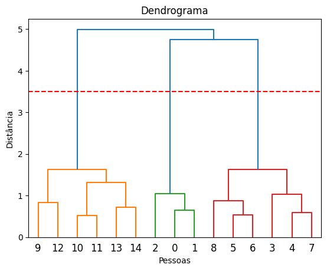
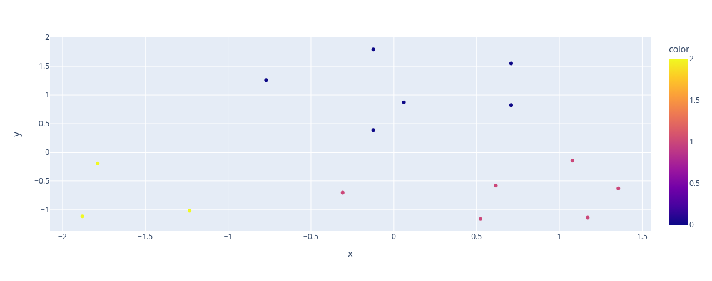

# Agrupamento hierárquico - base salário idade

## Biblioteca Scipy

### Função `dendrogram`

A função `dendrogram` do módulo `scipy.cluster.hierarchy` é usada para criar um dendrograma a partir de uma matriz de ligação (linkage matrix) calculada após a realização de um algoritmo de agrupamento hierárquico. Um dendrograma é um tipo de representação gráfica de uma hierarquia de agrupamentos, onde os objetos são aninhados em grupos com base em sua similaridade.

**Parâmetros principais:**

- **Z (array-like)**: A matriz de ligação gerada pelo algoritmo de agrupamento hierárquico, que conecta grupos de observações em uma estrutura hierárquica.

- **truncate_mode (str, opcional)**: Este parâmetro permite que você especifique como deseja cortar o dendrograma se ele for muito longo para caber na tela. Os valores possíveis incluem "lastp" (mantém apenas os últimos `p` níveis de clusters), "level" (corta o dendrograma em uma altura especificada) e "mtica" (mantém o maior nível de clusters possível).

- **p (int, opcional)**: Se o `truncate_mode` for definido como "lastp", este parâmetro especifica quantos níveis de clusters a serem mantidos. Por exemplo, `p=3` manterá apenas os últimos três níveis de clusters.

- **level (float, opcional)**: Se o `truncate_mode` for definido como "level", este parâmetro especifica a altura na qual o dendrograma deve ser cortado. A altura é geralmente uma distância euclidiana entre clusters.

- **above_threshold_color (str, opcional)**: A cor dos clusters acima do nível de corte especificado quando `truncate_mode` é usado.

- **below_threshold_color (str, opcional)**: A cor dos clusters abaixo do nível de corte especificado quando `truncate_mode` é usado.

**Retorno:**

A função `dendrogram` retorna um objeto de dicionário que contém várias informações sobre o dendrograma gerado, incluindo as posições x e y dos nós (clusters) e informações sobre quais pontos de dados pertencem a cada cluster.

**Exemplo:**

```python
import numpy as np
from scipy.cluster.hierarchy import dendrogram, linkage
import matplotlib.pyplot as plt

# Base de dados
x = [20,  27,  21,  37,  46, 53, 55,  47,  52,  32,  39,  41,  39,  48,  48]
y = [1000, 1200, 2900, 1850, 900, 950, 2000, 2100, 3000, 5900, 4100, 5100, 7000, 5000, 6500]

base_salary = np.array([
  [age, salary]
  for age, salary in zip(x, y)
])

# Calcule a matriz de ligação
linkage_matrix = linkage(base_salary, method='ward')

# Crie o dendrograma
dendrogram_ = dendrogram(linkage_matrix)
plt.title("Dendrograma")
plt.xlabel("Pessoas")
plt.ylabel("Distância")
plt.axhline(y=3.5, color='r', linestyle='--');
```

Saída:



> A linha representa o número ideal de cluster, que no caso é 3, pois a reta da direita não cruza com nenhum ponto na horizontal, com base isso essa reta seria um bom ponto de análise.

Neste exemplo, geramos dados aleatórios, calculamos a matriz de ligação usando o método de ligação "ward", criamos o dendrograma e o exibimos usando Matplotlib. O dendrograma mostrará como os dados foram agrupados hierarquicamente com base em sua similaridade. Você pode ajustar a aparência do dendrograma e personalizá-lo de acordo com suas necessidades.

## Sklearn

### Classe `AgglomerativeClustering`

A classe `AgglomerativeClustering` no módulo `sklearn.cluster` implementa o algoritmo de agrupamento aglomerativo, que é uma técnica de agrupamento hierárquico. Esse algoritmo é usado para agrupar amostras em clusters hierárquicos, criando uma árvore de clusters (dendrograma). Essa árvore pode ser visualizada posteriormente para entender as relações hierárquicas entre os clusters.

**Principais parâmetros:**

- **n_clusters (int, opcional, padrão=2)**: O número de clusters que o algoritmo deve formar. Se não for especificado, o algoritmo formará dois clusters por padrão.

- **affinity (string ou callable, opcional, padrão="euclidean")**: A métrica de distância a ser usada para calcular a similaridade entre as amostras. Pode ser uma das métricas de distância predefinidas do `scikit-learn`, como "euclidean" (distância euclidiana), "manhattan" (distância de Manhattan), "cosine" (similaridade cosseno), entre outras. Você também pode fornecer uma função personalizada para calcular a similaridade.

- **linkage (string, opcional, padrão="ward")**: O critério de ligação (linkage criterion) a ser usado para determinar a distância entre os clusters. Os valores possíveis incluem "ward" (minimização da variância dos clusters), "complete" (distância máxima), "average" (média das distâncias), "single" (distância mínima), entre outros.

- **compute_full_tree (bool, opcional, padrão=True)**: Se definido como True, o algoritmo construirá a árvore de clusters completa. Se definido como False, ele usará uma estratégia de redução de custos para calcular a árvore de clusters parcial.

- **distance_threshold (float, opcional, padrão=None)**: Se definido, o algoritmo interromperá a criação de clusters quando a distância entre os clusters exceder esse limite.

**Principais métodos:**

- **fit(X)**: Este método ajusta o modelo aos dados de entrada `X`. Ele calcula os clusters com base nos parâmetros especificados e nos dados de entrada.

- **fit_predict(X)**: Este método ajusta o modelo aos dados de entrada `X` e retorna os rótulos dos clusters a que cada amostra pertence.

**Principais atributos:**

- **labels_**: Este atributo armazena os rótulos dos clusters atribuídos a cada amostra após a chamada ao método `fit_predict`.

**Exemplo:**

```python
from sklearn.cluster import AgglomerativeClustering
import numpy as np

# Base de dados
x = [20,  27,  21,  37,  46, 53, 55,  47,  52,  32,  39,  41,  39,  48,  48]
y = [1000, 1200, 2900, 1850, 900, 950, 2000, 2100, 3000, 5900, 4100, 5100, 7000, 5000, 6500]

base_salary = np.array([
  [age, salary]
  for age, salary in zip(x, y)
])

# Criar uma instância do modelo
hc_salary = AgglomerativeClustering(n_clusters=3, linkage="ward", affinity="euclidean")

# Ajustar o modelo aos dados
labels = hc_salary.fit_predict(base_salary)

# Exibição dos rótulos dos clusters
graph = px.scatter(x = base_salary[:,0], y = base_salary[:,1], color = labels)
graph.show()
```

Saída:



Neste exemplo, geramos dados aleatórios, criamos uma instância do modelo `AgglomerativeClustering` com 3 clusters e ajustamos o modelo aos dados. O método `fit_predict` retorna os rótulos dos clusters atribuídos a cada amostra.