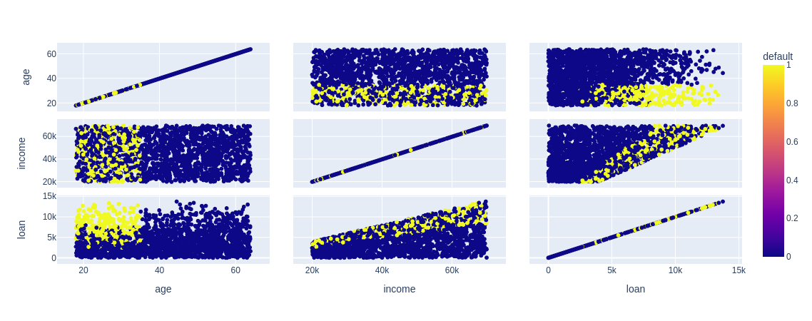

# Visualização dos dados

> ## **Biblioteca NumPy**

### **Função `unique()`**

A função `numpy.unique()` é uma função utilizada para retornar os valores únicos (distintos) de um array ou lista. Ela retorna um novo array contendo somente os elementos únicos presentes no array original, em ordem crescente por padrão.

**Sintaxe:**

```python
numpy.unique(arr, return_index=False, return_inverse=False, return_counts=False, axis=None)
```

**Parâmetros principais:**

- **arr:** Obrigatório. O array de entrada do qual os valores únicos serão extraídos.

- **return_index:** Opcional. Se True, retorna um array que contém os índices dos elementos únicos no array original.

- **return_inverse:** Opcional. Se True, retorna um array que mapeia cada elemento do array original para sua posição no array de valores únicos.

- **return_counts:** Opcional. Se True, retorna um array que conta o número de ocorrências de cada valor único no array original.

- **axis:** Opcional. Especifica o eixo ao longo do qual a função é aplicada. Se não for fornecido, a função será aplicada a todo o array.

**Exemplo:**

```python
import numpy as np

# Criando um array de exemplo com elementos repetidos
arr = np.array([2, 5, 1, 2, 3, 1, 4, 5, 2, 1])

# Obtendo os valores únicos do array
valores_unicos = np.unique(arr)

print(valores_unicos)
```

**Resultado:**

```
[1 2 3 4 5]
```

No exemplo acima, a função `numpy.unique()` foi aplicada ao array `arr`, que contém elementos repetidos. O resultado é um novo array contendo somente os elementos únicos em ordem crescente.

### **Função `histplot()`**

A função `histplot()` é uma função para criar um histograma, que é uma representação gráfica da distribuição de frequência de uma variável numérica.

**Sintaxe:**

```python
seaborn.histplot(data, x=None, bins='auto', kde=False, color=None)
```

**Parâmetros principais:**

- **data:** Obrigatório. O DataFrame ou conjunto de dados que contém a variável numérica a ser plotada no histograma.

- **x:** Opcional. Especifica a variável numérica a ser plotada no eixo x. Se não fornecido, o histograma será plotado com base em `data`.

- **bins:** Opcional. Especifica a quantidade de bins (intervalos) a serem usados no histograma. Pode ser um número inteiro, uma sequência de valores representando os limites dos bins ou a string 'auto', que usa uma heurística para determinar automaticamente os bins.

- **kde:** Opcional. Se True, adiciona uma estimativa da função de densidade do kernel ao histograma, produzindo um gráfico de densidade.

- **color:** Opcional. Especifica a cor do histograma.

**Exemplo:**

```python
import seaborn as sns
import matplotlib.pyplot as plt

# Criando um DataFrame de exemplo
base_credit = pd.read_csv("./assets/credit_data.csv")

# Plotando o histograma para a coluna "loan"
sns.histplot(x = base_credit["loan"]);
```

**Resultado:**


A função `histplot()` é muito útil para visualizar a distribuição de dados numéricos e identificar padrões, outliers e tendências nos dados. Ela é amplamente utilizada em análise exploratória de dados e na compreensão da distribuição dos dados em um conjunto de dados. A opção `kde=True` pode ser útil para sobrepor uma estimativa de densidade suavizada ao histograma, o que pode fornecer insights adicionais sobre a distribuição dos dados.

> ## **Biblioteca Seaborn**

### **Função `countplot()`**

A função `countplot()` é uma função da biblioteca Seaborn em Python, que é uma extensão do Matplotlib utilizada para criar gráficos estatísticos atraentes e informativos. Essa função é usada para plotar um gráfico de contagem, que exibe a contagem de ocorrências de cada categoria em um conjunto de dados categóricos.

**Sintaxe:**

```python
seaborn.countplot(x=None, y=None, data=None, order=None, hue=None, palette=None)
```

**Parâmetros principais:**

- **x, y:** Obrigatórios. Especificam as variáveis categóricas a serem plotadas no eixo x e/ou y. O usuário deve fornecer apenas uma das opções, pois o gráfico será bidimensional.

- **data:** Obrigatório. O DataFrame ou conjunto de dados que contém os dados a serem plotados.

- **order:** Opcional. A ordem em que as categorias devem aparecer no gráfico.

- **hue:** Opcional. Permite adicionar uma variável categórica adicional, que será representada por cores diferentes no gráfico, tornando possível a comparação entre duas variáveis categóricas.

- **palette:** Opcional. Especifica a paleta de cores a ser utilizada no gráfico.

**Exemplo:**

```python
import seaborn as sns
import matplotlib.pyplot as plt

# Criando um DataFrame de exemplo
base_credit = pd.read_csv("./assets/credit_data.csv")

# Plotando o gráfico de contagem para a coluna "Classe"
sns.countplot(x = base_credit["default"]);
```

**Resultado:**


> **OBS** antes de exibir o gráfico uma mensagem similar a `<Axes: xlabel='default', ylabel='count'>`, e caso queira que isso não seja mostrado, basta colocar `;` no final da sentença da função `countplot()`.

A função `countplot()` é especialmente útil para visualizar a distribuição de dados categóricos e identificar as frequências de cada categoria de forma rápida e eficiente. Ela é muito utilizada em análise exploratória de dados e na comparação de diferentes categorias em um conjunto de dados.

> ## **Biblioteca Plotly**

### **Função `scatter_matrix()`**

A função `scatter_matrix()` do Plotly Express é usada para criar uma matriz de gráficos de dispersão (_scatter_) para visualizar as relações entre pares de variáveis numéricas em um DataFrame. Ela oferece recursos adicionais para visualização interativa e personalização dos gráficos.

**Sintaxe:**

```python
import plotly.express as px

fig = px.scatter_matrix(df, dimensions=[coluna1, coluna2, ...], color=coluna_cor, symbol=coluna_simbolo, ...)
fig.show()
```

**Principais parâmetros:**

- **df:** Obrigatório. O DataFrame contendo as colunas numéricas que serão plotadas nos gráficos de dispersão.

- **dimensions:** Obrigatório. Especifica as colunas numéricas que serão plotadas na matriz de dispersão.

- **color:** Opcional. Permite adicionar uma coluna categórica para colorir os pontos de acordo com seus valores.

- **symbol:** Opcional. Permite adicionar uma coluna categórica para especificar símbolos diferentes para cada categoria.

- **labels:** Opcional. Permite adicionar rótulos personalizados para as colunas do DataFrame.

- **title:** Opcional. Especifica o título do gráfico.

**Exemplo:**

```python
import plotly.express as px
import pandas as pd

# Criando um DataFrame de exemplo
base_credit = pd.read_csv("./assets/credit_data.csv")

# Plotando a matriz de dispersão com Plotly Express
grafico = px.scatter_matrix(base_credit, dimensions=["age", "income", "loan"], color="default")
grafico.show()
```

**Resultado:**

