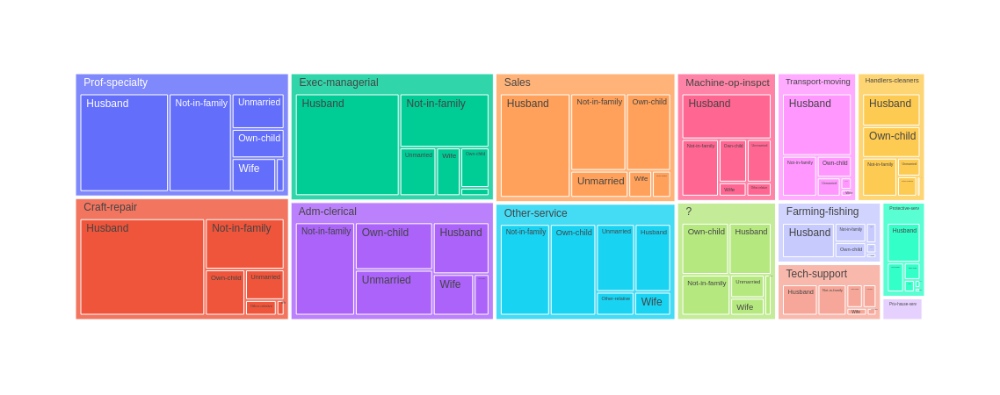
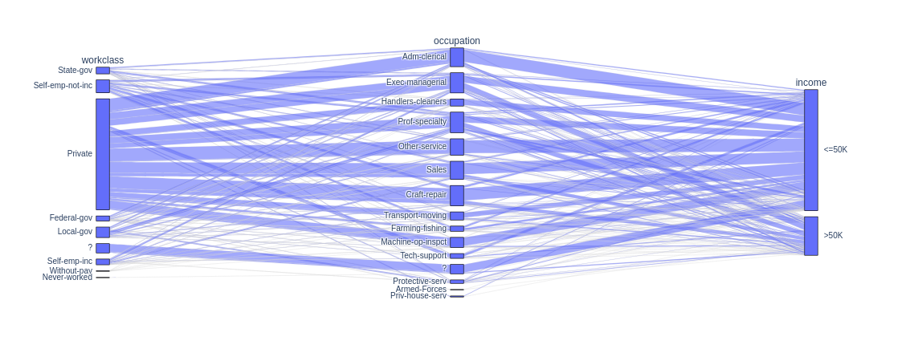

# Visualização dos dados

> ## **Tipos de gráficos**

### **Gráficos treemaps**

**Treemaps** são gráficos de visualização hierárquica que representam dados em formato retangular, usando áreas coloridas para representar diferentes categorias ou valores. Cada retângulo é subdividido em outros retângulos menores, formando uma estrutura de árvore. A hierarquia é visualmente representada pela posição e tamanho dos retângulos, onde os retângulos maiores representam categorias de nível superior e os retângulos menores representam subcategorias.

**Principais características dos Treemaps:**

- **Hierárquico:** Os dados são organizados em uma estrutura de árvore hierárquica.
- **Retangular:** Os retângulos representam cada nível hierárquico.
- **Áreas proporcionais:** O tamanho dos retângulos é proporcional aos valores dos dados que eles representam, o que facilita a comparação das quantidades entre diferentes categorias.
- **Cores:** As cores são usadas para codificar informações adicionais ou atributos dos dados.

**Quando usar Treemaps:**

- **Visualização Hierárquica:** Os Treemaps são ideais para visualizar dados com hierarquias, como categorias e subcategorias, permitindo que você veja as relações e proporções entre os diferentes níveis.
- **Comparação Proporcional:** Se você precisa comparar proporções e distribuições dentro de diferentes categorias, os Treemaps são uma ótima escolha, pois o tamanho das áreas é proporcional aos valores.
- **Análise de Dados Multidimensionais:** Os Treemaps podem lidar com dados com várias dimensões, mostrando as categorias, subcategorias e outras informações relevantes em um único gráfico.

**Exemplos de uso:**

- **Visualização de Gastos:** Em uma análise financeira, você pode usar um Treemap para mostrar a divisão dos gastos em diferentes categorias (por exemplo, alimentação, moradia, transporte) e, em seguida, subdividir cada categoria em subcategorias menores (por exemplo, tipos específicos de despesas).
- **Gerenciamento de Projetos:** Os Treemaps são úteis para exibir a estrutura de um projeto, com as principais fases como categorias de nível superior e as tarefas individuais como subcategorias.
- **Análise de Vendas:** Ao analisar dados de vendas, um Treemap pode ajudar a mostrar a receita gerada por diferentes produtos ou regiões e como eles se comparam entre si.

Em resumo, os Treemaps são uma poderosa ferramenta de visualização que permite explorar e comunicar informações hierárquicas e proporcionais de forma eficaz. Eles são amplamente utilizados em várias áreas, como análise de negócios, gerenciamento de projetos, análise de dados e muito mais.

### **Gráficos de histogramas**

**Histogramas** são gráficos de barras usados para representar a distribuição de frequências de um conjunto de dados contínuo. Eles mostram a frequência ou o número de ocorrências de valores em intervalos específicos, chamados de "bins" ou "classes". Cada barra no histograma representa a contagem de valores que caem dentro de um intervalo.

**Principais características dos Histogramas:**

- **Variáveis Contínuas:** Os histogramas são adequados para analisar variáveis contínuas, como idade, altura, peso, tempo, etc., onde os valores podem assumir qualquer número dentro de um intervalo.
- **Bins:** Os dados são agrupados em intervalos (bins), e o eixo x do histograma representa esses intervalos, enquanto o eixo y mostra a contagem de valores em cada bin.
- **Área Total:** A área total do histograma é proporcional ao tamanho da amostra ou ao número total de dados.

**Quando usar Histogramas:**

- **Visualização da Distribuição de Dados:** Histogramas são amplamente utilizados para entender a distribuição de um conjunto de dados contínuo, mostrando onde os valores são mais concentrados ou dispersos.
- **Identificar Outliers:** Histogramas podem ajudar a identificar outliers, que são valores extremos que se desviam significativamente da maioria dos dados.
- **Tomada de Decisões:** Ao tomar decisões baseadas em dados, o conhecimento da distribuição dos dados pode ser essencial para entender padrões e tendências.

**Exemplos de uso:**

- **Idade da População:** Em uma análise demográfica, você pode criar um histograma para visualizar a distribuição das idades da população em intervalos como 0-10, 11-20, 21-30, etc.
- **Tempo de Espera:** Em uma fila de atendimento, um histograma pode mostrar a distribuição do tempo de espera dos clientes em diferentes intervalos de minutos.
- **Desempenho em Testes:** Em educação, um histograma pode ser usado para analisar a distribuição das notas dos alunos em uma prova.

Em resumo, os histogramas são uma ferramenta útil para visualizar e compreender a distribuição de dados contínuos. Eles permitem identificar padrões, tendências e outliers, tornando-os valiosos para análise exploratória de dados, tomada de decisões e comunicação de informações estatísticas.

### **Gráficos de categorias paralelas**

Os gráficos de categorias paralelas, também conhecidos como gráficos de coordenadas paralelas ou parallel coordinates plots em inglês, são uma forma de visualização que permite representar e comparar múltiplas séries de dados numéricos em um único gráfico. Essa representação é particularmente útil quando se lida com muitas variáveis ou atributos, pois ajuda a identificar padrões, tendências e relações entre os dados.

**Principais características dos gráficos de categorias paralelas:**

- **Eixos paralelos:** Cada atributo ou variável é representado por um eixo paralelo, e todos os eixos são desenhados paralelamente em um mesmo plano.
- **Linhas conectando pontos:** Cada ponto no gráfico representa uma observação (ou uma linha no conjunto de dados) e é conectado por linhas a cada eixo, mostrando os valores daquela observação em cada atributo.
- **Visualização de padrões:** Com os eixos paralelos, é possível visualizar rapidamente como os valores das variáveis se comportam em relação a cada observação. Isso pode ajudar a identificar agrupamentos, tendências e anomalias nos dados.
- **Facilita a comparação:** Como todas as séries de dados são exibidas em um único gráfico, é mais fácil comparar o comportamento de diferentes observações em relação a vários atributos.

**Quando usar gráficos de categorias paralelas:**

- **Análise exploratória de dados:** Os gráficos de categorias paralelas são úteis para explorar rapidamente padrões e relações nos dados, especialmente quando se lida com muitas variáveis.
- **Comparação de grupos:** É uma boa opção quando se deseja comparar grupos de dados e entender como eles diferem em relação a várias variáveis.
- **Identificação de outliers:** Esses gráficos podem ajudar a detectar valores atípicos que se destacam nas várias dimensões representadas pelos eixos.

**Exemplo de uso:**
Suponha que você tenha um conjunto de dados com informações sobre várias casas, incluindo tamanho, número de quartos, preço, localização, entre outros atributos. Um gráfico de categorias paralelas pode ser usado para visualizar e comparar essas casas em relação a esses diferentes atributos. Isso permitiria identificar rapidamente casas com características semelhantes ou destacar casas que se destacam em relação a determinados atributos.

Em resumo, os gráficos de categorias paralelas são uma ferramenta poderosa para visualizar e explorar dados multivariados, tornando mais fácil a identificação de padrões e relações em conjuntos de dados complexos.

> ## **Biblioteca Ploly**

### Função `treemap`

A função `treemap` da biblioteca Plotly é usada para criar visualizações gráficas de treemaps, que são diagramas retangulares hierárquicos que exibem dados em uma estrutura de árvore. Cada retângulo no treemap representa uma categoria e é dimensionado proporcionalmente ao valor numérico associado a essa categoria. Essa representação ajuda a visualizar a distribuição de dados em uma hierarquia, mostrando o tamanho relativo de cada categoria e suas subcategorias.

**Sintaxe:**

```python
import plotly.express as px

fig = px.treemap(data_frame, path=['coluna1', 'coluna2', ...], values='coluna_valor')
```

- `data_frame`: O DataFrame que contém os dados a serem plotados.

- `path`: Uma lista com as colunas que representam a hierarquia das categorias no treemap. Cada elemento da lista representa um nível na hierarquia.

- `values`: A coluna do DataFrame que contém os valores numéricos associados a cada categoria.

**Exemplo:**

```python
import plotly.express as px

# Carregando a base de dados
base_census = pd.read_csv("./assets/census.csv")

# Criando o treemap
fig = px.treemap(base_census, path=["occupation", "relationship"])

# Exibindo o gráfico
fig.show()
```

**Saída:**



O treemap é uma ótima ferramenta para visualizar dados hierárquicos e entender a contribuição de cada categoria para o todo. Ele pode ser útil em várias áreas, como análise de vendas, distribuição de gastos, entre outros. A biblioteca Plotly fornece uma forma simples e interativa de criar treemaps de maneira eficiente.

### **Função `parallel_categories`**

A função `parallel_categories` do módulo plotly.express da biblioteca Plotly é utilizada para criar gráficos de categorias paralelas. Esse tipo de gráfico é uma visualização poderosa para representar e comparar múltiplas séries de dados categóricos em um único gráfico.

**Sintaxe:**

```python
import plotly.express as px

fig = px.parallel_categories(data_frame, dimensions=dimensions, color=color_column)
```

**Parâmetros:**

- `data_frame`: O DataFrame do Pandas contendo os dados a serem plotados.

- `dimensions`: Lista das colunas categóricas do DataFrame que serão usadas como eixos no gráfico de categorias paralelas.

- `color`: Opcionalmente, você pode especificar uma coluna categórica do DataFrame para atribuir cores às categorias nos gráficos, tornando mais fácil distinguir diferentes grupos de dados.

**Exemplo:**

```python
import pandas as pd
import plotly.express as px

# Carregando a base de dados
base_census = pd.read_csv("./assets/census.csv")

# Criando o gráfico de categorias paralelas
fig = px.parallel_categories(base_census, dimensions=["workclass", "occupation", "income"])

# Exibindo o gráfico
fig.show()
```

**Saída:**



Os gráficos de categorias paralelas são úteis quando se deseja explorar e comparar rapidamente múltiplas variáveis categóricas em um único gráfico. Isso ajuda a identificar padrões, agrupamentos e relações entre as diferentes categorias, permitindo uma análise mais detalhada de conjuntos de dados complexos com várias dimensões categóricas.
