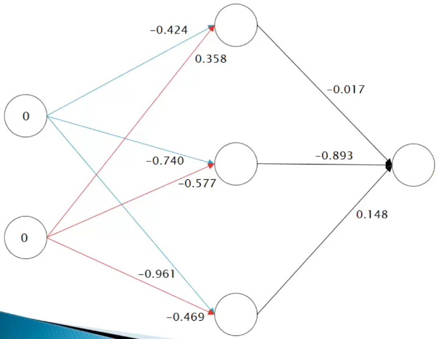

# Redes multicamada - ativação camada oculta I

Um exemplo de problema não linearmente separável é a separação dos valores 0 e 1 de uma tabela com os atributos previsores "x1" e "x2" e o atributo meta "Classe" que segue a lógica do operador lógico XOR ("ou exclusivo").

| x1  | x2  | Classe |
| :-: | :-: | :----: |
|  0  |  0  |   0    |
|  0  |  1  |   1    |
|  1  |  0  |   1    |
|  1  |  1  |   0    |

Com base nos dados da tabela acima, obter uma correlação entre os atributos x1 e x2 a fim de prever o valor do atributo meta "Classe". Para isso será utilizado uma rede neural multilayer Perceptron com 3 neurônios (presentes na camada oculta) e com o seus respectivos pesos:

O primeiro passo é calcular o valor da função soma utilizando a seguinte fórmula para cada neurônio:

$$
\text{soma} = \sum_{i=1}^n{x_i \cdot w_i}
$$

Em seguida, passar o resultado obtido na função soma como o parâmetro $x$ da função sigmoid e aplicá-la para cada neurônio novamente:

$$
y = \frac{1}{1 + e^{-x}}
$$

Com o resultado de cada neurônio, basta aplicar novamente a função soma e ativação para os valores obtidos na função sigmoid e assim obter o resultado final para o primeiro registro. 

Você deve repetir todo o processo descrito acima para cada registro da tabela.