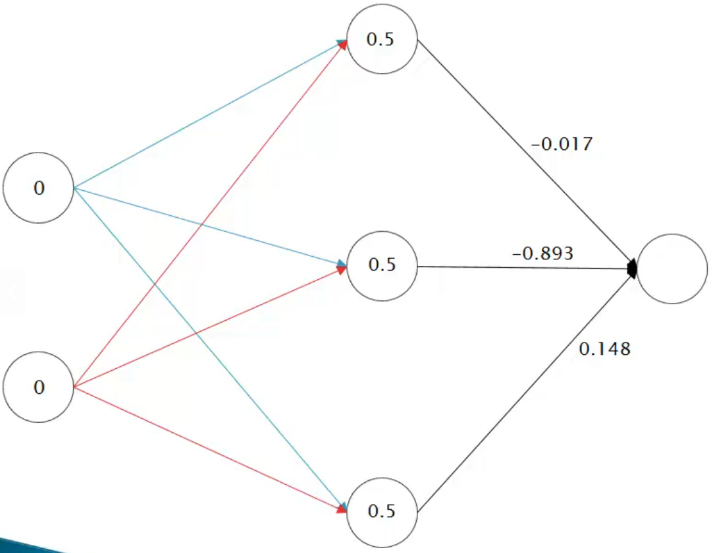

# Redes multicamada - ativação camada saída

Após o calculo dos neurônios das camadas ocultas, vamos calcular o valor da camada de saída.

Primeiramente, é necessários aplicar a função soma:

$$
soma = \sum_{i=1}^{n}{x_i \cdot w_i} = 0.5 \cdot (-0.017) + 0.5 \cdot (-0.893) + 0.5 \cdot 0.148 = -0.381
$$

Em seguida aplicar a função de ativação passando como parâmetro o valor calculado na soma:

$$
y = \frac{1}{1 + e^{-x}} = 0.406
$$

E então aplicar todo esse processo para cada registro da tabela.