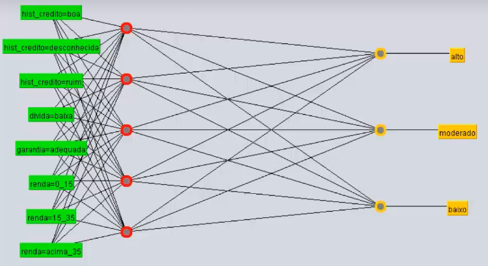

# Redes multicamada - saída com mais neurônios e Deep learning

## **Saída com mais neurônios**

Nos tópicos anteriores foi abordado redes neurais multicamadas com apenas 1 neurônio de saída a fim de facilitar o cálculo e entendimento desse modelo, porém é possível definir mais de 1 neurônio de saída. Na literatura, é amplamente adotado 1 neurônio de saída para cada valor do atributo meta. Por exemplo:

## **Deep Learning**

Embora as primeiras teorias sobre rede neurais sejam relativamente antigos, esse modelo foi deixado de lado por falta de capacidade computacional e haviam outras alternativas como o SVM (Máquinas de vetores de suporte), que era amplamente utilizado em meados de 1990 por ser computacionalmente barato e com uma performance satisfatório. Apenas em 2006, foram criados os primeiros algoritmos para treinamento de redes neurais.

A classificação como uma rede profunda (_deep learning_) se dá quando um rede neural possui duas ou mais camadas ocultas. Para o desenvolvimento de rede profunda é requerido um outro conjunto de técnicas e a aplicação dos métodos utilizados em rede neurais Perceptron de uma camada ou mais camadas podem trazer resultados insatisfatórios.

Um dos problemas das redes neurais tradicionais é o "problema do gradiente desaparecendo" (ou "vanishing gradient problem") no qual o gradiente admite valores muito pequeno e então as mudanças nos pesos ficam cada vez mais insignificantes acarretando o alto consumo computacional para o treinamento da rede neural.

A seguir alguns tópicos importantes para se aprofundar nesse tema:

- Rede neurais convolucionais

- Redes neurais recorrentes

- Ferramentas como Keras, Theano e TensorFlow

- Conceitos sobre programação em GPU