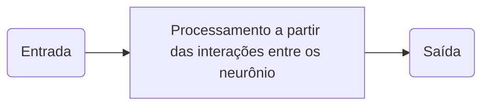

# Fundamentos biológicos

Antes de nos aprofundarmos nas rede neurais artificiais, é importante entendermos o que são neurônios e como eles interagem entre si com uma ótica biológica.

O neurônio é utilizado pelo cérebro para processar informações. 

Ele é composto por 3 partes fundamentais:

- Copo celular (núcleo da célula)

- Dendritos

- Axônio

A conexão entre os neurônios é feito a partir da **sinapse** que produzidos pelo axônios para transmitir o sinal de um neurônio para outro por meio de sinais elétricos. As substâncias químicas são lançadas das sinapses e entram pelos dendritos, aumentando ou abaixando o potencial elétrico do corpo celular. 

Em uma rede neural artificial, essa diferença de potencial é responsável pela tomada de decisão, ou seja, o neurônio artificial é disparado (liga ou não liga) caso a entrada for maior que um número definido, chamado de **limiar**.

