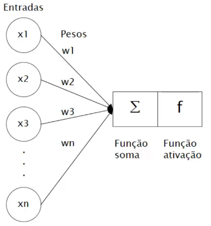

# Neurônio artificial

O primeiro modelo de neurônio artificial foi proposto por McCulloch e Pitts em 1943. Em 1958, Frank Rosenblatt desenvolveu o modelo de **Perceptron** que é o mais utilizado atualmente.

Abaixo está um exemplo de representação do modelo de perceptron:

Onde:

- $x_1$ a $x_n$: representam as entradas

- $w_1$ a $w_n$: representam os pesos de cada entrada

- Função soma: realizar o somatório da multiplicação do valor de entrada pelo seu respectivo peso

  $$
  \text{função soma} = \sum_{i=1}^n{x_i \cdot w_i}
  $$
