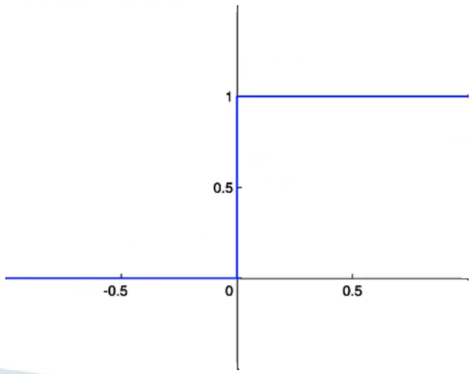

# Perceptron de uma camada

A seguir um exemplo de _perceptron_ de uma camada:

Como primeiro passo, vamos aplicar a função de soma nas entradas:

$$
\text{soma} = \sum_{i=1}^n{x_i \cdot w_i} \\
\text{soma} = (1 \cdot 0.8) + (7 \cdot 0.1) + (5 \cdot 0) \\
\text{soma} = 0.8 + 0.7 + 0 \\
\text{soma} = 1.5
$$

> Lembrando que os pesos são análogos as sinapses, os quais são os responsáveis por ativar ou não os neurônios a partir do aumento ou diminuição do potencial elétrico do corpo da célula.

Na próxima etapa, utilizaremos o valor obtido através da função soma na _step function_ (função degrau) e então a partir desse resultado o neurônio artificial será ativado ou não.

A _step function_ é uma fórmula matemática utilizada como parâmetro na ativação do neurônio. O funcionamento dela é bem simples:

- Caso o resultado da função soma seja superior a 0, então é atribuído o valor 1 ao neurônio artificial, ou seja, ele é ativado;

- Caso contrário, é atribuído o valor 0 e o neurônio não é ativado.

A seguir está um representação gráfica da _step function_:

Os pesos são uma métrica relevante na ativação de um neurônio, pois como já foi citado anteriormente, os pesos são equivalente as sinapses, logo eles podem amplificar ou reduzir o sinal de entrada. Além disso os pesos podem ser classificados como sinapse excitadora (peso positivo) ou sinapse inibidora (peso negativo). Por fim, o **conhecimento da rede neural são os pesos**, ou seja, o treinamento dela consiste em obter o melhor conjunto de pesos para um base de dados.