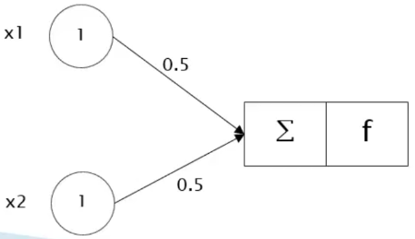

# Ajuste dos pesos I

As entradas de uma rede neural são representadas pelos atributos de uma base de dados e é responsabilidade dela de achar o melhor conjunto de pesos para cada um desses atributos.

Em aprendizagem supervisionada, uma das formas de alcançar isso é com a utilização do operador `and` (e):

| x1  | x2  | Classe |
| :-: | :-: | :----: |
|  0  |  0  |   0    |
|  0  |  1  |   0    |
|  1  |  0  |   0    |
|  1  |  1  |   1    |

Onde:

- `x1` e `x2` são os atributos previsores

- `Classe` é o atributo meta (previsão)

Como exemplo de ajuste de peso, vamos utilizar a lógica do operador `and` descrita na tabela acima. Vamos percorrer todas as linhas dessa tabela para tirarmos uma conclusão sobre um determinado conjunto de peso, inicialmente com os pesos $w_1 = 0$ e $w_2 = 0$, respectivamente para os atributos x1 e x2:

Vamos calcular se a previsão do modelo está correta, usando os pesos especificados anteriormente, para a 1º linha com x1 = 0 e x2 = 0:

> Lembrando que a fórmula da função soma é:
>
> $$
> \text{soma} = \sum_{i=1}^n{x_i \cdot w_i}
> $$

$$
\text{soma} = 0 \cdot 0 + 0 \cdot 0 = 0
$$

Como o resultado da função soma é 0, logo a _step function_ também retornará 0, indicando que o neurônio artificial não será ativado.

Agora na 2º linha, temos x1 = 0 e x2 = 1, então:

$$
\text{soma} = 0 \cdot 0 + 1 \cdot 0 = 0
$$

E o valor da _step function_ também é 0.

Em seguida, na 3º linha, temos x1 = 1 e x2 = 0, então:

$$
\text{soma} = 1 \cdot 0 + 0 \cdot 0 = 0
$$

Logo o valor da _step function_ também é 0.

Por fim, na 4º linha, temos x1 = 1 e x2 = 1, então:

$$
\text{soma} = 1 \cdot 0 + 1 \cdot 0 = 0
$$

Nesse caso, o resultado esperado na função soma era 1 já que ambos os atributos possuem o valor de 1, porém foi obtido 0. Isso aconteceu por causa da escolha incorreta dos pesos, sendo assim, por não ter atingido a precisão próxima ou igual a 100%, então é necessário realizar o ajuste dos pesos até atingir um patamar com a menor margem de erro possível.

Nesse exemplo, a taxa de acerto é de 75%, pois de 4 tentativas o modelo errou 1 (a última linha).

Dessa forma, há alguns algoritmos para o cálculo do erro de um modelo, sendo a mais simples definida pela seguinte fórmula:

$$
\text{Erro} = \text{Resposta correta} - \text{Resposta calculada}
$$

Você deve aplicar essa fórmula para cada registro da base de dados. Seguindo o exemplo acima, temos:

- Na 1º Linha:

  $$
  \text{Erro} = 0 - 0 = 0
  $$

- Na 2º Linha:

  $$
  \text{Erro} = 0 - 0 = 0
  $$

- Na 3º Linha:

  $$
  \text{Erro} = 0 - 0 = 0
  $$

- Na 4º Linha:

  $$
  \text{Erro} = 1 - 0 = 1
  $$

Podemos concluir que o erro desse conjunto de peso foi de 1, então é necessário atualizar os pesos até os erros serem mínimos e para isso temos a seguinte fórmula:

$$
peso(n + 1) = peso(n) + (\text{Taxa de aprendizagem} \times \text{Entrada} \times \text{Erro})
$$

Onde:

- $peso(n)$ é o peso atual

- $\text{Taxa de aprendizagem}$ é um valor fixo que representa o quanto que o valor do peso vai avançar a cada ajuste

- $\text{Entrada}$ é o valor de entrada

- $\text{Erro}$ é o erro cometido pelo peso atual

Ao ajustar os pesos, é necessário aplicar essa fórmula para cada entrada da rede neural. Veja o exemplo abaixo:

Vamos corrigir os pesos pegando como base no registro da 4º linha, pois foi onde apresentou um erro:

- No atributo x1 temos:

  $$
  peso(n + 1) = 0 + (0.1 \cdot 1 \cdot 1) = 0.1
  $$

- No atributo x2 temos:

  $$
  peso(n + 1) = 0 + (0.1 \cdot 1 \cdot 1) = 0.1
  $$

Após os ajuste de pesos a fim de reduzir ao máximo os erros, temos o seguinte conjunto de pesos para a rede neural:

