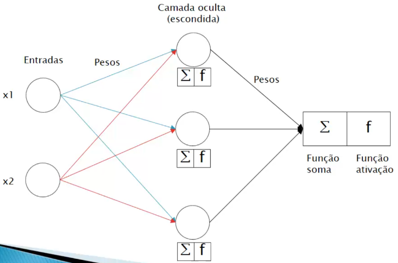

# Introdução a redes neurais multicamada

O modelo Perceptron é aplicado apenas para problemas linearmente separados, não sendo adequado para problemas mais atuais, uma vez que possuem um alto grau de complexidade. Dessa forma, foi desenvolvido as **redes multicamadas**, também chamado de **_multilayer perceptron_**. A seguir está uma representação desse algoritmo:

> O software [WEKA](https://www.cs.waikato.ac.nz/ml/weka/) possui uma implementação desse algoritmo.

Como é possível notar, existe uma nova camada chamada de "camada oculta" responsável pela execução das funções soma e ativação, da mesma forma com o modelo Perceptron de uma camada. Com o resultado dessa camada, é aplicado novamente as funções soma e ativação para então obter o resultado final. Esse processo é denominado de **_feed forward_**.
