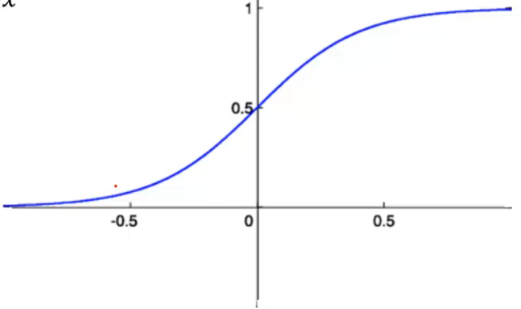
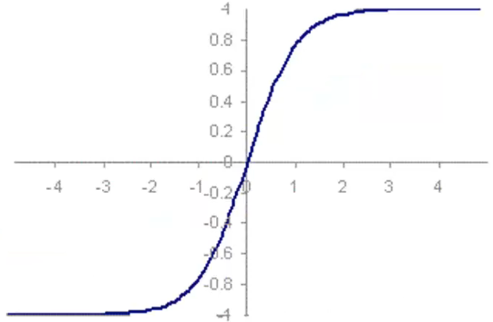

# Funções de ativação

A _step function_ (função degrau), como foi visto anteriormente no modelo Perceptron de uma camada, é uma função de ativação bem simples, e que não se encaixa na maioria dos casos, exceto nesse tipo de modelo. 

A **função sigmoide** retorna valores entre o intervalo de $[0, 1]$, diferentemente da função degrau o qual os únicos valores possíveis são 0 e 1. A aplicação dela apresenta uma performance bem satisfatória na maioria dos casos. A seguir está a representação do gráfico dessa função:

Esse gráfico é descrito a partir da função:

$$
y = \frac{1}{1 + e^{-x}}
$$

A função sigmoid não retorna valores negativos.

> Os neurônios que utilizam a função sigmoide como função ativadora são denominados de **neurônio sigmoide**.

Caso seja necessário retornar valores negativos, existe a **função tangente hiperbólica** (_hyperbolic tangent_) que retorna valores entre $[-1, 1]$:

$$
y = \frac{e^x - e^{-x}}{e^x + e^{-x}}
$$

Essa função é representada pelo seguinte gráfico:

