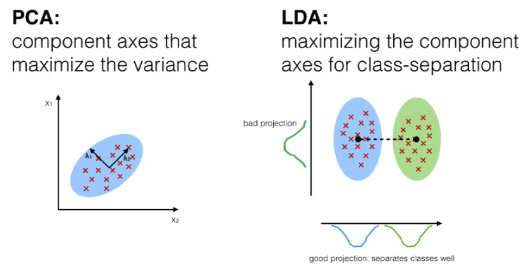

# PCA (Principal Component Analys), LDA (Linear Discriminant Analysis) e KernelPCA

## Seleção de Características vs. Extração de Características

É fundamental entender a diferença entre seleção de características e extração de características antes de aprofundarmos sobre as técnicas de redução de dimensionalidade.

Na seleção de características, você escolhe um subconjunto das características originais com base em algum critério (como relevância para a tarefa de aprendizado de máquina). 

Na extração de características, você cria novas características que são combinações lineares das características originais. Em outras palavras é como se aplicação um compressão de atributos.

## PCA (Principal Component Analysis)

O PCA (Principal Component Analysis) é uma técnica de análise de dados que se encaixa no paradigma de redução de dimensionalidade, especificamente na categoria de extração de características. É uma das ferramentas mais amplamente utilizadas na análise exploratória de dados e pré-processamento de dados em aprendizado de máquina e estatística.

- O PCA é uma técnica não supervisionada, o que significa que não requer um atributo de classe (variável dependente). Ele é usado principalmente para explorar a estrutura dos dados e reduzir a dimensionalidade.

- O objetivo principal do PCA é identificar correlações entre as variáveis originais. Se duas ou mais variáveis estiverem fortemente correlacionadas, isso indica que elas compartilham informações semelhantes. O PCA tenta capturar essas informações compartilhadas em um conjunto menor de novas variáveis, chamadas componentes principais.

- Das m variáveis independentes originais, o PCA extrai p (onde $p \leq q$) novas variáveis independentes que explicam melhor a variação presente na base de dados. Cada nova variável é uma combinação linear das variáveis originais.

- A escolha do número de componentes principais (p) é flexível e pode ser determinada pelo usuário com base em critérios como a quantidade de variação explicada.

**Vantagens:**

- Redução da dimensionalidade: O PCA é usado para reduzir a dimensionalidade dos dados, o que é especialmente útil quando você está lidando com conjuntos de dados com muitas características. Reduzir a dimensionalidade pode ajudar a simplificar a análise e reduzir o risco de overfitting em modelos de aprendizado de máquina.

- Eliminação de multicolinearidade: O PCA pode ajudar a eliminar a multicolinearidade (correlação alta entre variáveis independentes), o que pode melhorar a interpretabilidade dos modelos.

- Compressão de dados: O PCA pode ser usado para comprimir dados enquanto mantém informações essenciais. Isso é útil em sistemas de armazenamento e transmissão de dados.

- Visualização de dados: O PCA também é usado para visualizar dados de alta dimensão em um espaço bidimensional ou tridimensional.

## LDA (Linear Discriminant Analysis)

O LDA (Linear Discriminant Analysis), ou Análise de Discriminante Linear em português, é uma técnica de redução de dimensionalidade que compartilha semelhanças com o PCA (Principal Component Analysis) em termos de encontrar combinações lineares de características originais. No entanto, o LDA tem um objetivo diferente e é geralmente usado em tarefas de classificação.

- Além de encontrar as componentes principais que descrevem a variação nos dados, o LDA também se concentra em encontrar eixos que maximizam a separação entre múltiplas classes em um problema de classificação.

- O LDA é um algoritmo supervisionado, o que significa que ele requer a informação das classes para realizar a redução de dimensionalidade. Ele é usado principalmente em tarefas de classificação, onde há uma variável dependente (rótulos de classe) que você deseja prever com base nas características independentes.

- A principal diferença entre o LDA e o PCA é que, enquanto o PCA se concentra em encontrar eixos que maximizam a variação total nos dados, o LDA se concentra em encontrar eixos que maximizam a separação entre as classes. Portanto, o LDA leva em consideração a estrutura de classe dos dados.

- Das m variáveis independentes originais, o LDA extrai p (onde $p \leq q$) novas variáveis independentes que melhor separam as classes da variável dependente. Essas novas variáveis são chamadas de discriminantes lineares.

**Vantagens:**

- Redução de dimensionalidade com foco na separação de classes: O LDA é especialmente útil em tarefas de classificação, onde o objetivo é maximizar a separação entre as classes. Ele ajuda a reduzir a dimensionalidade mantendo as informações que são mais discriminativas para a tarefa de classificação.

- Melhor desempenho em classificação: Em muitos casos, o LDA pode melhorar o desempenho de algoritmos de classificação em comparação com o uso de todas as características originais.

- Interpretabilidade: As novas variáveis obtidas pelo LDA podem ser interpretadas como as características mais discriminativas para a tarefa de classificação.

**Diferenças entre LDA e PCA:**

- **Objetivo**: O PCA visa maximizar a variação total dos dados, enquanto o LDA visa maximizar a separação entre múltiplas classes em um problema de classificação. Em outras palavras, o LDA considera a informação de classe durante a redução de dimensionalidade.

- **Supervisão**: O LDA é um algoritmo supervisionado, o que significa que ele usa rótulos de classe conhecidos para guiar a extração de características. O PCA é não supervisionado, o que significa que ele opera apenas com base na estrutura de dados sem considerar as classes.

- **Número de Componentes**: Assim como o PCA, o LDA também reduz a dimensionalidade, mas geralmente produz menos componentes principais do que o PCA. O número máximo de componentes principais que podem ser extraídos pelo LDA é igual ao número de classes menos um (C - 1), onde C é o número de classes no problema de classificação.

## Kernel PCA

O Kernel PCA (Principal Component Analysis) é uma extensão do método de PCA (Principal Component Analysis) que permite lidar com dados que não são linearmente separáveis no espaço original. O PCA é uma técnica de redução de dimensionalidade que opera encontrando os componentes principais dos dados, que são combinações lineares das características originais que explicam a maior variação nos dados. No entanto, o PCA assume que os dados são linearmente separáveis, o que nem sempre é o caso na prática.

O Kernel PCA resolve esse problema introduzindo uma técnica chamada "kernel trick". Em vez de mapear os dados para um espaço de características de maior dimensão usando funções de kernel, o Kernel PCA aplica o kernel diretamente no cálculo dos componentes principais. Isso permite que o Kernel PCA encontre componentes principais em um espaço de características de maior dimensão, onde os dados podem se tornar linearmente separáveis.

- **Kernel Trick**: O kernel é uma função que mede a similaridade entre dois pontos de dados em um espaço de alta dimensão. O uso de funções de kernel permite que o Kernel PCA encontre componentes principais em um espaço de características de alta dimensão sem a necessidade de calcular explicitamente a transformação de espaço. Alguns exemplos de funções de kernel comuns incluem o kernel RBF (Radial Basis Function) e o kernel polinomial.

- **Componentes Principais no Espaço de Kernel**: O Kernel PCA encontra componentes principais no espaço de kernel, que é uma representação de maior dimensão dos dados. Esses componentes principais são chamados de "autovetores de kernel". Eles podem ser usados da mesma forma que os componentes principais no PCA convencional para redução de dimensionalidade.

- **Seleção de Kernel**: A escolha da função de kernel é crucial no Kernel PCA e pode afetar significativamente o desempenho. A seleção do kernel depende da natureza dos dados e do problema em questão.

O Kernel PCA é útil quando os dados não podem ser adequadamente separados por hiperplanos lineares no espaço de características original. É frequentemente usado em problemas de reconhecimento de padrões, classificação de imagens e análise de dados onde a estrutura dos dados é complexa e não linear.
