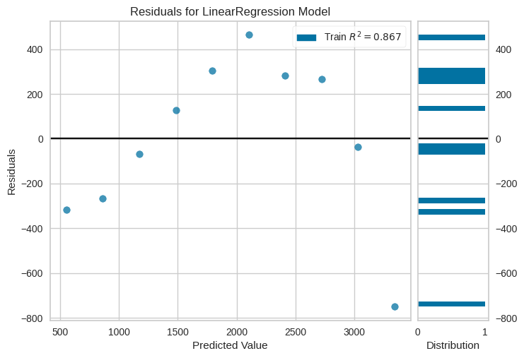

# Regressão linear simples - base plano saúde

## Biblioteca Sklearn

### Classe `LinearRegressor`

A classe `LinearRegression` do módulo `sklearn.linear_model` é uma das implementações mais simples e amplamente usadas da regressão linear em Python. Ela permite criar modelos de regressão linear para tarefas de regressão simples e múltipla. A regressão linear é um método estatístico que modela a relação linear entre uma variável dependente (a ser prevista) e uma ou mais variáveis independentes (usadas para fazer a previsão).

Aqui está uma explicação sobre os principais aspectos e funcionalidades da classe `LinearRegression`:

**Sintaxe:**

Você pode criar uma instância da classe `LinearRegression` da seguinte maneira:

```python
from sklearn.linear_model import LinearRegression
modelo = LinearRegression()
```

**Principais atributos:**

1. **`coef_`:** Este atributo retorna os coeficientes (ou pesos) estimados para cada variável dependente no modelo. Se você tiver várias características, haverá um coeficiente para cada uma delas.

   ```python
   coeficientes = modelo.coef_
   ```

2. **`intercept_`:** Este atributo retorna o valor do intercepto do modelo, ou seja, o valor estimado da variável independente quando todas as variáveis dependentes são iguais a zero.

   ```python
   intercepto = modelo.intercept_
   ```

**Principais métodos:**

1. **`fit(X, y)`:** Este método é usado para treinar o modelo de regressão linear. Ele espera duas entradas:

   - `X`: Uma matriz (ou DataFrame) de forma (n_samples, n_features) que representa as variáveis independentes (também chamadas de atributos ou características).
   - `y`: Um vetor (ou série) de forma (n_samples,) que representa a variável dependente que você deseja prever.

   ```python
   modelo.fit(X, y)
   ```

2. **`predict(X)`:** Após treinar o modelo, você pode usá-lo para fazer previsões em novos dados. O método `predict` aceita um conjunto de dados de teste (matriz) como entrada e retorna as previsões correspondentes para a variável dependente.

   ```python
   y_pred = modelo.predict(X_test)
   ```

3. **`score(X, y)`**: Este método é usado para calcular o coeficiente de determinação ($R^2$) do modelo.

   - `X`: é uma matriz (ou DataFrame) contendo as variáveis independentes (características).
   - `y`: é um vetor (ou série) contendo a variável dependente (alvo).

   ```python
   modelo.score(X_test, y_test)
   ```

**Exemplo:**

Aqui está um exemplo de uso da classe `LinearRegression` para treinar um modelo de regressão linear simples em Python:

```python
from sklearn.linear_model import LinearRegression

# Dados de exemplo
X = [[1], [2], [3], [4]]
y = [2, 4, 5, 4]

# Criação do modelo
modelo = LinearRegression()

# Treinamento do modelo
modelo.fit(X, y)

# Fazendo previsões
X_test = [[5], [6]]
y_pred = modelo.predict(X_test)

# Coeficientes e intercepto
coeficientes = modelo.coef_
intercepto = modelo.intercept_
```

A classe `LinearRegression` do Scikit-Learn oferece uma maneira simples e eficaz de realizar análises de regressão linear em Python, tanto para problemas simples quanto para problemas mais complexos com várias variáveis independentes. É amplamente utilizada em tarefas de previsão e análise de dados.

## Biblioteca YellowBrick

### Classe `ResidualsPlot`

A classe `ResidualsPlot` do módulo `yellowbrick.regressor` é uma ferramenta útil para visualizar e avaliar os resíduos (erros) de um modelo de regressão. Os resíduos são a diferença entre os valores reais (observados) e as previsões feitas pelo modelo. A análise dos resíduos é importante para verificar se o modelo de regressão está capturando adequadamente a estrutura dos dados.

**Sintaxe**:

```python
from yellowbrick.regressor import ResidualsPlot
visualizer = ResidualsPlot(model)
```

**Principais métodos**:

- **`fit(X, y)`**: Este método é usado para ajustar o gráfico de resíduos ao modelo de regressão e aos dados de treinamento.

  - `X` são as variáveis independentes (características) dos dados de treinamento.
  - `y` é a variável dependente (alvo) correspondente aos dados de treinamento.

- **`poof()`**: Este método gera um gráfico de resíduos que mostra os resíduos em relação às previsões do modelo. Ele também inclui uma linha de referência no valor zero, que indica onde os resíduos deveriam estar idealmente se o modelo fosse perfeito. O gráfico de resíduos pode ajudar a identificar tendências ou padrões nos resíduos, como heterocedasticidade (variância não constante) ou não linearidade.

**Exemplo**:

```python
from yellowbrick.regressor import ResidualsPlot
from sklearn.linear_model import LinearRegression
import numpy as np

# Carregando os dados
base_health_insurance = pd.read_csv("../../assets/plano_saude.csv")
X_health_insurance = base_health_insurance.iloc[:, 0].values.reshape(-1, 1)
y_health_insurance = base_health_insurance.iloc[:, 1].values

# Criando um modelo de regressão linear
regressor_health_insurance = LinearRegression()

# Ajustando o modelo aos dados de treinamento
regressor_health_insurance.fit(X_health_insurance, y_health_insurance)

# Criando o gráfico de resíduos
visualizer = ResidualsPlot(regressor_health_insurance)

# Ajustando o gráfico aos dados de treinamento
visualizer.fit(X_health_insurance, y_health_insurance)

# Exibindo o gráfico
visualizer.poof()
```



Neste exemplo, estamos criando um modelo de regressão linear, ajustando-o aos dados de treinamento e, em seguida, usando a classe `ResidualsPlot` para criar e exibir o gráfico de resíduos. O gráfico de resíduos ajudará na avaliação da qualidade do ajuste do modelo e na identificação de quaisquer padrões nos resíduos que podem indicar problemas no modelo. Isso é útil para diagnosticar problemas como heterocedasticidade, não linearidade ou outliers nos dados.

## Biblioteca NumPy

### Função `ravel`

A função `ravel()` no NumPy é usada para transformar um array multidimensional em uma única matriz unidimensional. Em outras palavras, ela "desenrola" ou "achatap" um array multidimensional, tornando-o uma sequência de elementos em uma única dimensão.

Aqui estão os principais pontos a serem observados sobre a função `ravel()`:

**Sintaxe**:

```python
numpy.ravel(array, order='C')
```

**Parâmetros**:

- `array`: O array multidimensional que você deseja achatar.
- `order` (opcional): A ordem em que os elementos serão lidos. Pode ser 'C' (ordem padrão da linguagem C) ou 'F' (ordem Fortran, que lê os elementos por coluna).

**Retorno**:

- Retorna uma matriz unidimensional que contém todos os elementos do array original.

**Exemplo**:

```python
import numpy as np

# Criando um array multidimensional
arr = np.array([[1, 2, 3], [4, 5, 6]])

# Usando ravel para achatar o array
flattened = np.ravel(arr)

print(flattened)
```

Neste exemplo, o array multidimensional `arr` é achatado usando `np.ravel()`, resultando em um array unidimensional `flattened`. O resultado será `[1, 2, 3, 4, 5, 6]`, onde todos os elementos do array original são organizados em uma única dimensão.

A função `ravel()` é útil quando você deseja operar em elementos individuais de um array multidimensional ou quando precisa passar um array multidimensional como entrada para uma função que espera um array unidimensional. Lembre-se de que a função `ravel()` não cria uma cópia dos dados; ela retorna uma visão (view) dos dados do array original, portanto, as alterações feitas no array achatado também afetarão o array original. Se você deseja criar uma cópia independente, pode usar a função `flatten()`.

### Função `reshape`

A função `reshape()` no NumPy é usada para alterar a forma (ou dimensões) de um array multidimensional sem modificar seus dados. Ela permite reorganizar os elementos de um array em uma nova estrutura, especificando as dimensões desejadas. A função `reshape()` é muito útil quando você precisa ajustar a forma de um array para que ele corresponda aos requisitos de uma operação ou algoritmo específico.

Aqui estão os principais pontos a serem observados sobre a função `reshape()`:

**Sintaxe**:

```python
numpy.reshape(array, newshape, order='C')
```

**Parâmetros**:

- `array`: O array que você deseja remodelar.
- `newshape`: A nova forma desejada para o array, especificada como uma tupla de inteiros. Cada valor na tupla representa o tamanho da dimensão correspondente.
- `order` (opcional): A ordem em que os elementos serão lidos. Pode ser 'C' (ordem padrão da linguagem C) ou 'F' (ordem Fortran, que lê os elementos por coluna).

**Retorno**:

- Retorna um novo array com a forma especificada, mantendo os dados do array original.

**Exemplo**:

```python
import numpy as np

# Criando um array unidimensional
arr = np.array([1, 2, 3, 4, 5, 6])

# Usando reshape para transformá-lo em um array 2D (matriz)
reshaped = np.reshape(arr, (2, 3))

print(reshaped)
```

Neste exemplo, o array unidimensional `arr` é remodelado usando `np.reshape()` para criar um novo array com a forma `(2, 3)`. O resultado será uma matriz 2x3:

```
[[1 2 3]
 [4 5 6]]
```

Você pode alterar a forma do array para qualquer dimensão desejada, desde que o número total de elementos no array original seja compatível com a nova forma. Por exemplo, no caso acima, o array original tinha 6 elementos, que é igual ao produto de 2 e 3, permitindo a remodelação para uma matriz 2x3.

A função `reshape()` é extremamente útil em tarefas de processamento de dados, como manipulação de imagens, séries temporais e muito mais, onde a reorganização de dados é comum para fins de análise ou modelagem.
